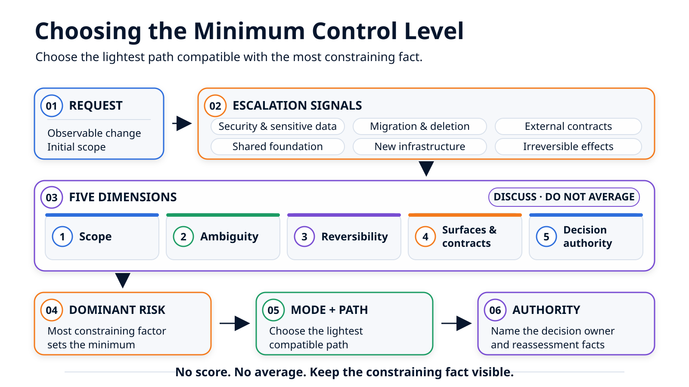

# Quatre modes, deux parcours : choisir le bon niveau de contrôle { .article-title }

Une correction locale, une fonctionnalité de bout en bout et une évolution du socle ne justifient ni le même contexte, ni les mêmes validations, ni la même autorité de décision. Le bon niveau de contrôle dépend du profil de risque du changement, pas du nombre de lignes ni de l'outil qui les produit.
{ .article-lead }

<p class="article-meta">
  <span>Par <span class="article-author">Vincent El Kouby-Benichou</span>, <a class="article-company-link" href="https://baracoda.com">Baracoda</a></span>
  <a class="article-contact-link" href="https://www.linkedin.com/in/vincentelkoubybenichou/">LinkedIn</a>
</p>

Un [repository agent-ready](../agent-ready-repository/index.md) indique où l'agent peut agir, quelles règles il doit respecter et dans quelles situations il doit s'arrêter. Il ne dit pas encore combien de structure mérite chaque demande.

Corriger le libellé de l'état vide, ajouter une action locale, paginer l'annuaire clients de bout en bout et modifier une primitive partagée sont quatre changements de nature différente. Leur appliquer exactement le même parcours serait une erreur dans les deux sens : trop peu de contrôle rend le changement fragile ; trop de contrôle transforme une correction locale en cérémonie.

Le nombre de lignes aide peu à trancher. Une modification de quelques caractères dans une règle d'autorisation peut affecter tous les utilisateurs. À l'inverse, une adaptation visuelle répartie sur plusieurs fichiers peut rester locale, visible et facile à annuler. La taille du diff Git ne dit ni qui doit décider, ni ce que le changement engage.

Le texte fondateur, [Du vibe coding au développement agentique vérifiable](../ai-agent-based-coding-best-practices/index.md), distinguait déjà quatre modes de développement avec agents. Ici, ils deviennent une grille de décision concrète.

> Le bon niveau de contrôle n'est ni le maximum systématique, ni le minimum choisi par défaut. C'est le dispositif le plus léger qui rende le risque et l'autorité de décision visibles.

## Mode, parcours et outil ne répondent pas à la même question

Avant de choisir, il faut séparer trois notions.

- Le **mode** qualifie le changement et le niveau de gouvernance qu'il exige.
- Le **parcours** organise le travail : entrée, étapes, artefacts, contrôles et relecture.
- L'**outil** exécute tout ou partie du parcours.

Ces distinctions empêchent de transformer une méthode éditoriale en documentation de logiciel. Les quatre modes présentés ici ne sont ni des valeurs de configuration, ni les états d'une machine interne. Une équipe peut les appliquer avec des fichiers Markdown, des scripts, une plateforme maison ou une combinaison d'outils existants.

> Le mode qualifie le changement. Le parcours organise le travail. L'outil reste un détail d'implémentation.

Les modes ne forment pas non plus une échelle de maturité. Une fonctionnalité structurée n'est pas « meilleure » qu'une correction locale contrôlée. Elle répond simplement à un autre profil. L'évolution du socle est encore différente : elle exprime aussi une question de responsabilité. Dès qu'une primitive, une règle ou un élément d'outillage partagé doit changer, cette catégorie prend le dessus, même si le diff attendu paraît minuscule.

## Cinq dimensions pour qualifier le changement

La décision peut commencer par cinq questions. Elles ne servent pas à calculer une note ; elles rendent le risque discutable.

| Dimension | Question à poser | Profil léger | Signal de contrôle supplémentaire |
| --- | --- | --- | --- |
| Portée | Le changement reste-t-il dans une zone produit connue ? | Un comportement local, des chemins évidents | Plusieurs couches, domaines ou zones partagées |
| Ambiguïté | Le résultat attendu et les choix structurants sont-ils déjà arrêtés ? | Résultat observable, solution contrainte par les conventions existantes | Décision produit, technique ou architecturale encore ouverte |
| Réversibilité | Une annulation dans Git suffit-elle réellement pour supprimer l'effet ? | Pas de donnée durable ni d'utilisateur déjà dépendant du changement | Migration, effet externe ou retour coordonné nécessaire |
| Surfaces et contrats | Combien d'interfaces doivent évoluer ensemble ? | Un module, sans contrat partagé modifié | Interface, API, données, infrastructure ou clients multiples |
| Autorité | Qui peut accepter les décisions induites par le changement ? | Auteur et responsable du module | Produit, plateforme, sécurité, architecture ou partenaire externe |

La portée et les surfaces affectées semblent proches, mais elles ne décrivent pas la même chose. La portée mesure l'étendue du travail dans le repository. Les surfaces et contrats mesurent le couplage : une petite modification peut rester dans un seul fichier tout en changeant un contrat consommé par plusieurs systèmes.

La réversibilité doit, elle aussi, être évaluée sur l'effet réel, pas seulement sur Git. Annuler une révision Git est simple. Récupérer des données migrées, retirer une réponse d'API déjà consommée ou annuler un message envoyé à un système externe peut ne pas l'être.

Enfin, l'autorité ne mesure pas la difficulté technique. Elle répond à une autre question : la personne qui demande ou implémente le changement a-t-elle le droit d'accepter les conséquences ? Si l'acceptation exige l'accord du responsable de la sécurité, du propriétaire d'une API ou de l'équipe plateforme, le parcours doit rendre cette décision visible.

## Les signaux qui fixent un minimum de contrôle

Avant même de comparer les cinq dimensions, certains signaux empêchent de retenir un mode léger sans décision explicite :

- sécurité, authentification ou autorisations ;
- données sensibles ou obligations réglementaires ;
- migration, suppression de données ou opération destructive ;
- nouvelle dépendance ou nouveau service d'infrastructure ;
- contrat public, externe ou difficile à faire évoluer ;
- socle partagé, outillage ou règle commune ;
- effet externe difficilement réversible.

Ces signaux ne prescrivent pas tous le même mode. Un changement d'autorisation dans une fonctionnalité produit n'est pas nécessairement une évolution du socle. Il exige une décision explicite d'un responsable habilité et peut justifier un parcours orchestré.

Il ne faut donc pas additionner des points et faire une moyenne. Quatre indicateurs de faible risque n'annulent pas une migration de données ou une décision de sécurité. La dimension la plus contraignante fixe le niveau minimal de contrôle.

La règle de lecture tient en quatre étapes :

1. repérer les signaux qui imposent un contrôle renforcé ;
2. qualifier les cinq dimensions ;
3. choisir le mode compatible avec le risque dominant ;
4. consigner le décideur et les faits qui obligeraient à réévaluer ce choix.

<figure class="article-diagram">
  
  <figcaption>Le risque dominant fixe le contrôle minimal ; les autres dimensions affinent la décision.</figcaption>
</figure>

## La fiche de décision

La décision doit pouvoir être relue sans rouvrir la conversation. Une fiche courte suffit si elle consigne le raisonnement et l'autorité.

L'exemple suivant est un support de décision destiné aux humains et indépendant de tout outil. Il ne s'agit ni d'une configuration, ni de l'ordre de mission envoyé à l'agent.

```markdown
# Fiche de décision

Demande :
Résultat observable :
Périmètre initial :

| Dimension | Observation | Niveau |
| --- | --- | --- |
| Portée | | faible / modérée / élevée |
| Ambiguïté | | faible / modérée / élevée |
| Réversibilité | | simple / coordonnée / difficile |
| Surfaces et contrats | | une / plusieurs / partagés ou externes |
| Autorité nécessaire | | module / domaine / produit, plateforme ou sécurité |

Signaux d'escalade :
- [ ] sécurité, autorisations ou données sensibles
- [ ] migration ou opération destructive
- [ ] nouvelle dépendance ou infrastructure
- [ ] contrat public ou externe
- [ ] socle, outillage ou règle commune
- [ ] effet externe difficilement réversible

Décision :
- Mode de départ :
- Parcours :
- Justification :
- Entrée minimale :
- Sortie minimale :
- Décideur(s) ou rôle d'approbation :
- Réévaluer si :
```

Cette fiche intervient avant le contrat de tâche présenté dans l'article précédent. La fiche choisit le niveau de gouvernance ; le contrat borne ensuite l'exécution. Dans la fiche, le périmètre reste exprimé en surfaces et en responsabilités ; les chemins précis appartiennent au contrat de tâche. Décider comment travailler n'est pas encore dire précisément où l'agent peut écrire.

## Quatre variations d'un même annuaire clients

Les quatre modes deviennent plus clairs lorsqu'ils s'appliquent au même produit. Pour la suite pratique, je retiens ces libellés publics, qui francisent et stabilisent la taxonomie esquissée dans le texte fondateur.

| Mode | Profil dominant | Entrée minimale | Sortie minimale |
| --- | --- | --- | --- |
| **Vibe coding contrôlé** | Local, visible et réversible | Demande bornée | Diff relu et validation ciblée |
| **Codage guidé** | Non trivial, mais contenu dans une zone produit connue | Brief court et plan | Suivi, validations consignées et relecture |
| **Fonctionnalité structurée** | Transversale ou encore ambiguë | Brief clarifié, puis spécification si nécessaire | Tâches bornées, contrôles et résultats consignés |
| **Évolution du socle** | Modification d'une primitive, d'une règle ou d'un outillage commun | Proposition d'impact et responsable identifié | Changement séparé, compatibilité, validations élargies et revue dédiée |

### Vibe coding contrôlé : corriger le libellé de l'état vide

Le besoin est visible, local et facilement réversible. Il ne modifie aucun contrat, aucune dépendance ni aucun comportement partagé. Une demande précise, un diff relu et une validation ciblée peuvent suffire.

Le mot « contrôlé » est essentiel. Ce mode ne signifie pas que la conversation remplace les règles du repository. L'agent reste borné à la zone concernée, réutilise les conventions existantes et montre le résultat réel. Si le changement révèle un problème plus large dans le composant partagé, la tâche sort de ce mode.

### Codage guidé : ajouter une action locale avec les contrats existants

Ajouter une action dans l'annuaire peut toucher plusieurs fichiers, nécessiter de retrouver un composant existant et demander un test de comportement. Le résultat reste toutefois contenu dans une zone produit connue et ne modifie pas le contrat de l'API.

Un brief court et un plan constituent alors une entrée proportionnée : comportement attendu, fichiers probablement concernés, conventions à réutiliser et validations ciblées. Le suivi conservé hors de la conversation facilite la reprise et la relecture sans imposer toute la mécanique d'une fonctionnalité structurée.

Si l'action nécessite finalement une nouvelle route d'API, une dépendance ou une autorisation supplémentaire, le profil change. Le plan initial ne donne pas à l'agent l'autorité d'absorber silencieusement cette découverte.

### Fonctionnalité structurée : ajouter la pagination serveur

La pagination relie l'interface, l'API, le contrat de réponse, les états de chargement et les tests. Plusieurs décisions doivent être prises de manière cohérente : forme du contrat, page initiale, taille des pages, comportement aux limites et compatibilité avec les consommateurs existants.

Le travail mérite donc un brief clarifié, un découpage en tâches, des frontières explicites, des résultats de validation consignés et une synthèse de revue. Une spécification complète n'est pas automatique : elle devient utile si les décisions ouvertes ne peuvent pas être résolues proprement dans le brief et le plan.

### Évolution du socle : modifier une primitive partagée

Supposons enfin que la pagination exige de changer le routeur commun ou une primitive d'interface utilisée ailleurs. Le diff peut être court, mais la décision et la portée de l'impact ne le sont pas.

Ce changement doit devenir une unité de travail séparée. Son entrée n'est plus seulement le besoin de l'annuaire clients, mais une proposition d'impact : consommateurs affectés, compatibilité, stratégie de transition, validations élargies et responsable de la décision. Une évolution du socle ne donne pas carte blanche sur les fichiers partagés ; elle rend au contraire leur modification explicite et plus exigeante.

## Deux parcours, pas quatre chaînes d'exécution

Les quatre modes n'exigent pas quatre systèmes différents. Deux parcours, avec des variantes proportionnées, suffisent à mettre ces décisions en œuvre.

```text
demande qualifiée
├── parcours léger
│   ├── variante directe  → vibe coding contrôlé
│   └── variante suivie   → codage guidé
└── parcours orchestré
    ├── travail produit   → fonctionnalité structurée
    └── travail partagé   → évolution du socle, traitée séparément
```

Le **parcours léger** minimise le coût de coordination. Dans sa variante directe, la demande bornée mène à la modification, à une validation ciblée puis à la relecture du diff. Dans sa variante suivie, un brief court, un plan et un journal persistant sont ajoutés avant la relecture.

Cette mémoire reste proportionnée à la tâche. Si l'agent tient lui-même le journal, celui-ci aide à comprendre et reprendre le travail ; il ne devient pas pour autant une attestation indépendante.

Le **parcours orchestré** sépare davantage les rôles. Le brief est clarifié, le travail est découpé, le périmètre est borné, les résultats de contrôle et de validation sont conservés, puis une revue locale prépare le passage vers Git et la CI. L'évolution du socle suit la même séquence générale, mais dans une unité distincte et avec une analyse de compatibilité plus large.

Le parcours choisi décrit le dispositif minimal attendu. Il ne préjuge ni du modèle utilisé, ni de l'interface à partir de laquelle l'agent est appelé.

## Fiche remplie pour la pagination

| Dimension | Observation | Qualification |
| --- | --- | --- |
| Portée | Une fonctionnalité cohérente et bornée | Modérée |
| Ambiguïté | Le résultat est clair ; la forme exacte du contrat reste à confirmer | Modérée |
| Réversibilité | Pas de migration prévue, mais l'annulation doit être coordonnée entre l'interface et l'API | Coordonnée |
| Surfaces et contrats | Interface, API interne, tests et documentation | Plusieurs surfaces et un contrat d'API interne |
| Autorité nécessaire | Responsable de la fonctionnalité et propriétaire de l'API | Domaine |

Les facteurs dominants sont le travail sur plusieurs surfaces et l'évolution coordonnée d'un contrat interne. Aucun signal imposant à lui seul un contrôle renforcé n'est identifié : le périmètre initial ne prévoit ni migration, ni nouvelle dépendance, ni contrat public, ni donnée sensible, ni modification du socle.

La décision devient donc :

- **mode de départ :** fonctionnalité structurée ;
- **parcours :** orchestré ;
- **entrée minimale :** brief clarifié, critères d'acceptation et périmètre initial ;
- **sortie minimale :** plan et tâches bornées, résultats de contrôle et de validation consignés, diff relisible et revue humaine ;
- **décideurs :** responsable de la fonctionnalité avec le propriétaire de l'API ;
- **réévaluer si :** la solution exige une primitive de routage partagée, un contrat incompatible, une migration ou une nouvelle dépendance.

La fiche ne prouve pas que cette décision est parfaite. Elle rend le choix explicite, contestable et modifiable avant que l'agent ne transforme les hypothèses en code.

## Le mode est un point de départ, pas une autorisation

Une classification initiale est une hypothèse de travail. L'exploration peut révéler un fait qui change le profil : dépendance manquante, contrat externe, migration nécessaire ou composant partagé insuffisant.

Dans ce cas, l'exécution doit être suspendue. L'agent peut recommander une reclassification, mais il ne doit pas élargir seul son périmètre. La personne qui pilote la tâche, éventuellement aidée par le workflow, doit ensuite :

1. consigner le nouveau fait et son impact ;
2. confirmer ou modifier le mode et le parcours ;
3. identifier le décideur compétent ;
4. redéfinir le périmètre et les validations avant la reprise.

Pour l'annuaire clients, découvrir que la synchronisation de la page dans l'URL exige une modification du routeur partagé ne transforme pas rétroactivement la sortie de périmètre en changement acceptable. La tâche produit s'arrête ; l'équipe choisit une solution locale ou ouvre une évolution du socle séparée.

Cette capacité à reclasser compte davantage qu'une taxonomie parfaite dès le départ. Une grille utile n'essaie pas de prédire toute l'implémentation. Elle rend visibles les événements qui exigent une nouvelle décision.

## Conclusion

Choisir un mode revient à choisir le dispositif le plus léger qui reste compatible avec le risque dominant. Le nombre de lignes, le modèle ou l'outil ne suffisent pas. La portée, l'ambiguïté, la réversibilité, les contrats affectés et l'autorité nécessaire donnent une base plus solide.

Le contrat du repository fixe les règles du terrain. Le mode fixe le niveau de gouvernance. Le parcours fixe les étapes et les faits qui devront être conservés.

Pour la pagination de l'annuaire clients, la grille conduit à une fonctionnalité structurée et à un parcours orchestré. [Le prochain article suit ce parcours de bout en bout](../agentic-feature-end-to-end/index.md) : du brief clarifié à la revue locale, en montrant ce que chaque étape produit et ce qu'elle permet réellement d'affirmer.

<div class="article-footer-contact">
  <p>Pour discuter de cet article ou me laisser un message public :</p>
  <a class="article-contact-link" href="https://github.com/velkouby/ai-based-development/issues/new?template=contact.yml">Message sur GitHub</a>
</div>
