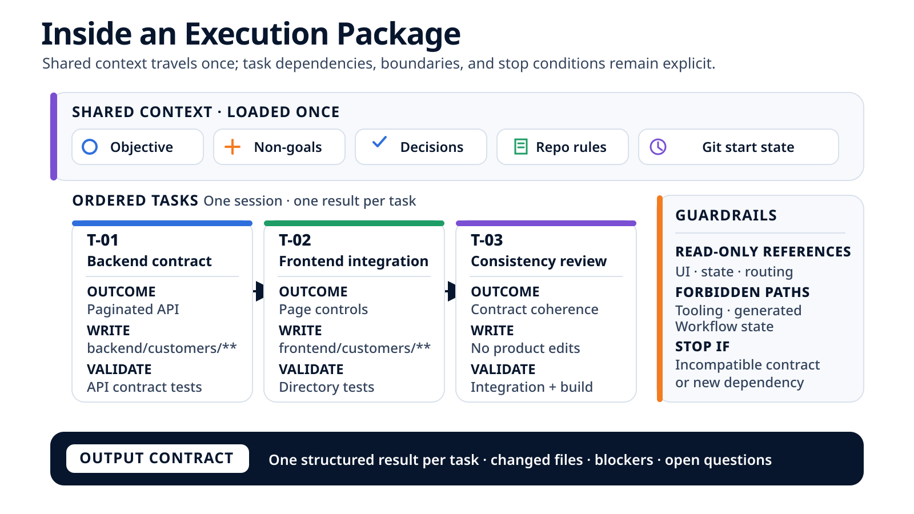

# What the Agent Actually Receives: Anatomy of an Execution Brief { .article-title }

It is 9:34 a.m. The pagination brief has been approved, all three tasks are ready, and the runner has not started yet. Let us open exactly what it will receive to execute the whole block without loading the same context three times.
{ .article-lead }

<p class="article-meta">
  <span>By <span class="article-author">Vincent El Kouby-Benichou</span>, <a class="article-company-link" href="https://baracoda.com">Baracoda</a></span>
  <a class="article-contact-link" href="https://www.linkedin.com/in/vincentelkoubybenichou/">LinkedIn</a>
</p>

In [the previous article](../agentic-feature-end-to-end/index.md), we followed server-side pagination for the customer directory from the brief to local review. An execution package appeared between the plan and the runner. Let us now pause the timeline just before coding and open that package piece by piece.

The plan contains three tasks: evolve the API, adapt the interface, and then check their consistency. Page numbering starts at `1`, the page size is `25`, an invalid page returns HTTP 404 with the code `pagination_page_invalide`, and URL synchronization remains a non-goal.

At this point, every required decision has been made. The remaining job is to transform this information into a unit the runner can execute without reconstructing the mission's authority from the conversation and the entire repository.

> An execution package is not a longer prompt. It is an ordered block of tasks with shared context, task-specific boundaries, and an observable starting state.

## 9:34 a.m.: A Three-Line Prompt Is Not Enough

We could send the agent this:

```text
Add server-side pagination to the customer directory.
Update the backend, frontend, and tests.
Follow the repository conventions.
```

The instruction sounds reasonable. Yet the agent still has to guess almost everything that governs its work.

| Question during execution | What those three lines do not say |
| --- | --- |
| Which page should load first? | Page `1` |
| How many items should be requested? | `25` |
| What happens for an invalid page? | Return HTTP 404 with `pagination_page_invalide` |
| Should the page appear in the URL? | No; it remains in local state for this release |
| Which files are writable? | The customer areas in the backend and frontend, with a boundary specific to each task |
| May shared components evolve? | No; they may be inspected, but changing them requires separate work |
| Which commands count? | `make test-back`, `make test-front`, and `make build-front` |
| What must be returned at the end? | A separate result for T-01, T-02, and T-03, including declared files, commands, questions, and blockers |

Adding these answers to one large paragraph would solve only part of the problem. Their roles would remain ambiguous: a reference to inspect could look like write authorization, a planning suggestion like a product decision, and an expected validation like a command that has already run.

The package keeps these categories separate so that the runner knows what to do and the workflow knows what to check afterward.

## 9:35 a.m.: Selecting a Coherent Task Block

The feature plan contains this chain:

```text
T-01 · backend contract
  -> T-02 · frontend integration
    -> T-03 · consistency check
```

T-02 depends on the contract produced by T-01. T-03 becomes relevant only after both changes. The three tasks also share the same objective, pagination decisions, and general boundaries. They therefore form a **coherent block** that the runner can execute in one session.

```text
complete plan
  -> select [T-01, T-02, T-03]
  -> add shared context and per-task contracts
  -> customer-pagination-01 package
  -> one runner session
  -> one result per task
```

Grouping them does not flatten the tasks. T-02 still depends on T-01; if T-01 uncovers an incompatibility with an existing consumer, the runner must stop the package before reporting T-02 or T-03 as complete.

Nor does the grouping grant access to the whole feature by default. A shared-router evolution does not join this block: URL synchronization is a non-goal, `shared/routing/**` is read-only, and changing its public interface would involve another owner, other consumers, and different validations.

> The workflow plans work at the task level. The coding agent plans the detailed modifications within the block.

## 9:36 a.m.: Loading Shared Context Once

In an implementation, the shared part of the package can look like this:

```yaml
package:
  id: "customer-pagination-01"
  attempt: "001"
  block: [T-01, T-02, T-03]

  objective: >-
    Add server-side pagination to the customer directory and allow users
    to change pages from the interface.

  acceptance_criteria:
    - "The API returns the items, current page, and total result count."
    - "The directory loads page 1 when it opens."
    - "Previous and Next actions respect the boundaries."
    - "The loading, empty, and error states remain distinct."

  decisions:
    first_page: 1
    page_size: 25
    invalid_page:
      http_status: 404
      code: "pagination_page_invalide"
    page_storage: "local state"

  non_goals:
    - "Synchronize the page with the URL."
    - "Modify a shared primitive."
    - "Add a dependency."
    - "Migrate or restructure data."

  shared_references:
    - "docs/customers/pagination.md"
    - "agent-docs/architecture.md"
    - "agent-docs/write-boundaries.md"

  writable_envelope:
    - "backend/customers/**"
    - "frontend/customers/**"

  read_only:
    - "docs/customers/pagination.md"
    - "shared/ui/**"
    - "shared/state/**"
    - "shared/routing/**"

  forbidden:
    - "tooling/**"
    - "generated/**"
    - "workflow-state/**"

  stop_if:
    - "A product decision remains open."
    - "The contract becomes incompatible with an existing consumer."
    - "A new dependency is required."
    - "The solution requires changing a shared area."
    - "A validation requires expanding the scope or environment."
```

Shared context is loaded once because it governs the entire block. It does not replace each task's contract. The writable envelope describes the maximum union of areas for the package; it does not mean that T-01 may edit the frontend or that T-02 may rewrite the backend.

The package does not contain all project documentation either. It carries the short decisions the agent will need continuously and points to the precise documents worth inspecting. Payment rules, future tasks, and the full chat history do not help paginate the directory, so they stay outside the context.

<figure class="article-diagram">
  
  <figcaption>Context travels once; outcomes, dependencies, and boundaries remain attached to each task.</figcaption>
</figure>

## 9:37 a.m.: Opening the Three Task Cards

The runner next receives the expected outcome, dependencies, paths, and validation specific to each task.

```yaml
tasks:
  - id: T-01
    outcome:
      - "GET /api/customers?page=2 returns items, page, and total."
      - "An invalid page returns HTTP 404 with pagination_page_invalide."
    depends_on: []
    writable:
      - "backend/customers/api.py"
      - "backend/customers/tests/test_pagination.py"
    read_only_references:
      - "docs/customers/pagination.md"
      - "frontend/customers/customer-api.ts"
    expected_validation: "make test-back"
    stop_if:
      - "The required contract would be incompatible with an existing consumer."

  - id: T-02
    outcome:
      - "customer-api.ts sends the requested page."
      - "The directory loads page 1 when it opens."
      - "Previous is disabled on page 1."
      - "Next is disabled when the total has been reached."
      - "The loading, empty, and error states remain covered."
    depends_on: [T-01]
    writable:
      - "frontend/customers/customer-api.ts"
      - "frontend/customers/customer-list.tsx"
      - "frontend/customers/customer-list.test.tsx"
    read_only_references:
      - "backend/customers/api.py"
      - "shared/ui/**"
      - "shared/state/**"
      - "shared/routing/**"
    expected_validation: "make test-front"
    stop_if:
      - "The solution requires changing Button, shared state, or the router."

  - id: T-03
    outcome:
      - "Check that the client consumes the backend contract exactly."
      - "Check that no URL synchronization has been introduced."
      - "Report any inconsistency without opening a new scope."
    depends_on: [T-01, T-02]
    writable: []
    read_only_references:
      - "backend/customers/**"
      - "frontend/customers/**"
    expected_validation: "make build-front"
```

The five expected files are therefore not a flat list attached to the prompt. Two belong to T-01, three to T-02, and none to T-03. This precision helps the agent order its work and makes its report reviewable task by task.

It does not, however, prove attribution. Because the runner executes the entire package in one session and the workflow takes no Git snapshot between tasks, the independent check will see the package diff. It can confirm that all five paths remain within the overall envelope, but not that a particular line was truly written during T-01 rather than T-02. That attribution remains declarative.

Validations have the same status at this point. `make test-front` appears in T-02 because that check must cover the directory behavior. The field is not a result. After the runner and the scope check, the workflow must still run or observe the command, preserve its exit code, and report any missing validation.

## 9:38 a.m.: Recording the Starting Git State

Immediately before handing the package to the runner, the workflow observes the working tree:

```text
$ git branch --show-current
feature/customer-pagination

$ git rev-parse --short HEAD
7a31c42

$ git status --short --untracked-files=all
# no output
```

The package therefore records:

```yaml
git_start:
  branch: "feature/customer-pagination"
  head: "7a31c42"
  modified_tracked_files: []
  staged_files: []
  untracked_files: []
  state: "clean"
```

This observation is useful: if five files appear after execution, none of them was visible in the selected starting state. Yet it remains an input, not final evidence. It says nothing about which commands will succeed, does not guarantee that the runner will remain on this branch, and does not replace the Git state recorded at the end.

An implementation should preserve the full Git object ID even though the article displays its short form. If the working tree were already modified, the package would need to list the affected paths or state explicitly that change attribution will be ambiguous.

## 9:39 a.m.: Rendering the Execution Brief for the Runner

The structured package can now be rendered into a direct instruction for the coding agent:

```text
Execute T-01, then T-02, then T-03 in this session.

Load the shared context once.
Respect the write boundary specific to each task.
Never write under shared/**, tooling/**, generated/**, or workflow-state/**.
Keep the page in local state; do not synchronize the URL.

Stop the entire package as soon as a stop condition is encountered.
Do not report a dependent task as complete after that stop.

Return a separate result for T-01, T-02, and T-03 with:
- the status and outcome achieved;
- the files you declare you changed;
- the commands you declare you ran;
- any remaining questions, warnings, and blockers.
```

The text is shorter than the data that produced it because it can summarize and order what matters to the runner. The complete structure remains available to the workflow for checking the result. This separation avoids treating the rendered text as the only record of the authority granted.

The expected output contract can be just as explicit:

```yaml
runner_result:
  package_status: "completed | blocked | failed"
  task_results:
    - id: "T-01"
      status: "..."
      summary: "..."
      declared_files: []
      declared_commands: []
      blocker: null
  open_questions: []
  warnings: []
```

When attempt `001` begins, none of those results has been filled in. The package defines the shape of the response; it does not prejudge its contents. Once the session ends, the agent's declared file list must be compared with the observed Git state, and the expected validations with their actual executions.

## Tracing Every Decision Back to Its Source

Provenance becomes concrete when we follow a few package values back to their sources.

| Compiled value | Source | Authority for this value |
| --- | --- | --- |
| Objective and criteria | Feature brief | Expected product outcome |
| Page size `25` and `pagination_page_invalide` error | `docs/customers/pagination.md` | Approved domain convention |
| Page retained in local state | Decision made during qualification | Trade-off for this release |
| `shared/routing/**` is read-only | Repository contract narrowed by the plan | Architectural boundary for the task |
| T-02 depends on T-01 | Executable plan | Work ordering |
| Clean working tree at `7a31c42` | Git observation at 9:38 a.m. | Local fact at the start of the attempt |

Authority depends on the subject. The plan may narrow the paths allowed by the repository; it cannot make a protected area writable. A Git observation can establish that a file is present; it cannot decide whether that change is desirable.

Compilation must therefore reject contradictions instead of blending them into ambiguous prose. If T-02 suddenly declared `shared/routing/**` writable, the package should not launch. If a task set the page size to `50` while the persisted decision says `25`, the discrepancy should be resolved before the runner starts.

## What This Package Enables—and What It Does Not

At 9:39 a.m., the runner has a more precise mission without receiving the entire project in its context window. It can coordinate the API evolution with its consumer, retain the same decisions across all three tasks, and organize the detailed edits itself.

The workflow also gains comparison points: expected tasks, the union of writable paths, read-only references, validations, and the output shape. But these benefits have clear limits.

- The package **describes authority**; by itself, it does not remove process permissions. Without a sandbox, path checking happens after writing.
- Commands in the package are **expected validations**, not results. An exit code must be observed and recorded separately.
- One snapshot before and one after the session qualifies **the package diff**, not the author of each task-level change.
- A clean starting Git state improves local attribution, but does not yet bind the attempt to a final merge-ready revision.
- A valid structure does not guarantee that the selected context is relevant, complete, or current.
- An oversized package would dilute the objective again. Any router evolution therefore remains a separate unit of work.

> A good package does not prevent the agent from making mistakes. It makes its instructions, boundaries, and deviations comparable with facts.

## Checking the Package Before Starting the Attempt

For this pagination feature, the pre-execution review fits into ten concrete questions:

- ☐ Do the criteria name the initial page, boundaries, and interface states?
- ☐ Do page size `25` and the 404 error still come from the current decision source?
- ☐ Can T-01, T-02, and T-03 run in sequence without a dependency outside the block?
- ☐ Does every writable file belong to a specific task?
- ☐ Are `shared/ui/**`, `shared/state/**`, and `shared/routing/**` read-only?
- ☐ Do `tooling/**`, `generated/**`, and `workflow-state/**` remain forbidden?
- ☐ Do all three expected commands exist independently of the future agent report?
- ☐ Does every stop condition say when not to continue to the next task?
- ☐ Does the Git state cover tracked, staged, and untracked files?
- ☐ Must the runner return a separate result for each of the three tasks?

If any answer is missing, correcting the package is safer than asking the agent to fill the silence during implementation.

## Conclusion

Attempt `001` is now ready. The runner will receive the brief, decisions, rules, and starting Git state once. It will execute T-01, T-02, and T-03 in the same session while preserving their dependencies, boundaries, and distinct results.

The benefit does not come from a particularly persuasive prompt. It comes from precise preparation: selecting a coherent block, removing unrelated context, preserving provenance, announcing validations, and making stops actionable.

But a well-prepared package does not guarantee an incident-free execution. A decision may be missing, a boundary may be crossed, or a validation may fail. [The next article shows how to classify those stops and resume without erasing the previous attempt](../agent-task-stop-and-resume/index.md).

<div class="article-footer-contact">
  <p>To discuss this article or leave me a public message:</p>
  <a class="article-contact-link" href="https://github.com/velkouby/ai-based-development/issues/new?template=contact.yml">Message on GitHub</a>
</div>
