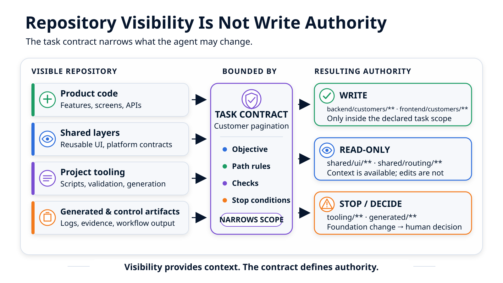

# Mon repository agent-ready : ce que l'agent doit savoir avant de coder { .article-title }

Avant de coder, un agent doit savoir où agir, quoi réutiliser, quelles limites respecter, comment valider et quand s'arrêter. Un repository agent-ready rend ces réponses visibles pour l'humain, actionnables par l'agent et vérifiables par le workflow.
{ .article-lead }

<p class="article-meta">
  <span>Par <span class="article-author">Vincent El Kouby-Benichou</span>, <a class="article-company-link" href="https://baracoda.com">Baracoda</a></span>
  <a class="article-contact-link" href="https://www.linkedin.com/in/vincentelkoubybenichou/">LinkedIn</a>
</p>

Un agent de code ne devrait pas travailler dans une conversation isolée, mais dans un système qui le guide, le limite et rend son travail relisible. C'était la thèse de [l'article précédent](../ai-agent-based-coding-best-practices/index.md). Ici, la question est plus concrète : **que doit contenir le repository avant que l'agent ne modifie une ligne de code ?**

Imaginons une demande apparemment locale : enrichir l'état vide d'un annuaire clients. L'agent trouve une primitive d'interface partagée, la modifie, ajoute le bouton demandé et fait passer les tests. Fonctionnellement, le résultat semble correct. Pourtant, une demande produit vient d'entraîner une modification du socle commun à toute l'application.

Le problème n'est pas que l'agent n'a pas compris le code. Il n'a pas compris l'autorité attachée aux différentes parties du code.

Un développeur expérimenté connaît souvent ces frontières sans les lire. Il sait quels dossiers contiennent le produit, quelles primitives sont partagées, quels fichiers sont générés, quelles commandes font foi et quels changements exigent une discussion d'architecture. Un agent ne possède pas cette mémoire implicite.

> Un repository agent-ready ne donne pas seulement du contexte à l'agent. Il lui donne un cadre d'action que le workflow peut confronter aux modifications réellement produites.

Ces principes peuvent être matérialisés dans un framework qui prépare le contexte de l'agent et contrôle une partie de son exécution. Les exemples qui suivent montrent une manière possible de rendre ce contrat observable.

## Le repository doit répondre avant l'agent

Explorer le code fait partie du travail. L'agent doit chercher les composants existants, lire les conventions locales et comprendre la surface concernée. Mais cette exploration ne devrait pas devenir, à chaque tâche, une enquête sur les règles fondamentales du projet.

Avant d'agir, l'agent doit pouvoir obtenir rapidement des réponses à sept questions :

1. Quel résultat observable est demandé ?
2. Où se trouve le code produit concerné ?
3. Quels composants, contrats ou modèles existants faut-il réutiliser ?
4. Quels chemins peut-il modifier pour cette tâche ?
5. Quels chemins peut-il consulter sans les modifier ?
6. Quelles validations doivent être exécutées ?
7. Dans quelles situations doit-il s'arrêter et demander une décision ?

Ces réponses ne doivent pas dépendre de la mémoire d'une personne, ni rester enfouies dans une ancienne revue de code. Elles doivent vivre dans le repository et être suffisamment stables pour être retrouvées par un humain, un agent et un workflow.

Cela ne signifie pas tout mettre dans un immense fichier d'instructions. Une règle d'architecture, une consigne destinée à l'agent, une politique de chemins et un résultat de validation n'ont pas le même rôle. Les confondre produit soit une documentation bavarde, soit une automatisation opaque.

## Une même règle, quatre supports

Une règle critique gagne à être déclinée sur quatre supports complémentaires.

| Support | Fonction | Limite |
| --- | --- | --- |
| Documentation humaine | Explique l'architecture, les responsabilités et les raisons d'un choix | Elle informe, mais n'empêche aucune modification |
| Instructions destinées à l'agent | Orientent l'agent au moment d'explorer, planifier et coder | Elles restent interprétées par le modèle |
| Contrat de tâche | Déclare précisément le périmètre, les validations et les conditions d'arrêt | Sans contrôle, il ne s'agit que d'une intention structurée |
| Contrôles du workflow | Comparent les faits observés au contrat et enregistrent les résultats | Ils ne prouvent que ce qu'ils ont effectivement observé |

Prenons la règle « une tâche produit ne doit pas modifier le socle partagé ».

La documentation explique pourquoi cette séparation existe. Le fichier d'instructions dit à l'agent de privilégier une extension locale. Le contrat de la tâche désigne les chemins modifiables et les zones en lecture seule. Enfin, le workflow inspecte le diff et signale si une zone protégée a été touchée.

Si la règle n'existe que dans la tête d'un développeur, elle est invisible. Si elle n'existe que dans la documentation, elle reste une recommandation. Si elle est déclarée dans un contrat sans être contrôlée, elle reste une politique théorique.

> Une règle utile doit être compréhensible par l'humain, actionnable par l'agent et vérifiable par le workflow.

Cette distinction évite aussi une confusion fréquente : une instruction n'est pas une autorisation système. Dire à l'agent « ne modifie pas ce dossier » ne retire pas ses droits d'écriture. Pour parler de garantie technique, il faut préciser quel mécanisme empêche ou détecte la modification.

## Rendre les responsabilités visibles

Un agent qui voit tout le repository ne doit pas nécessairement pouvoir agir partout avec la même liberté. La structure du projet doit rendre visibles des zones ayant des responsabilités différentes.

| Zone conceptuelle | Ce qu'elle contient | Politique habituelle pour une tâche produit |
| --- | --- | --- |
| Code produit | Fonctionnalités métier, écrans, API et documentation fonctionnelle | Écriture autorisée dans le périmètre précis de la tâche |
| Socle partagé | Primitives d'interface, architecture, configuration commune et contrats transversaux | Lecture autorisée, modification traitée comme un changement séparé |
| Outillage du projet | Scripts, commandes de validation, génération et configuration de développement | Hors périmètre par défaut ; modification soumise à une demande explicite |
| Artefacts générés ou de contrôle | Résultats, journaux, preuves et fichiers produits par le workflow | Produits par le mécanisme de contrôle ; toute altération par l'agent doit être détectée |

Les noms de dossiers importent moins que la politique qu'ils matérialisent. Deux projets peuvent avoir des arborescences très différentes tout en exprimant la même séparation.

La zone produit n'est d'ailleurs pas intégralement ouverte. Une tâche sur l'annuaire clients n'autorise pas automatiquement une modification du tunnel de paiement. La répartition générale des responsabilités définit les grandes zones ; le contrat de la tâche réduit ensuite l'autorité au périmètre nécessaire.

Le socle partagé, lui, n'est pas immuable. Il doit pouvoir évoluer. Mais une évolution du socle change les règles et les primitives dont dépendront d'autres fonctionnalités. Elle mérite donc une intention explicite, une analyse d'impact et des validations plus larges. Elle ne devrait pas apparaître comme l'effet secondaire discret d'une demande produit.

La règle pratique est simple :

> Si le besoin peut être satisfait dans la couche produit, il ne doit pas être résolu en modifiant le socle.

Cette séparation protège également les artefacts de contrôle. L'agent peut expliquer ce qu'il pense avoir fait, mais il ne devrait pas être le seul auteur des fichiers censés attester que les frontières ont été respectées ou que les validations ont réussi. Sinon, il devient à la fois exécutant et greffier de sa propre exécution.

## Un contrat d'exécution pour une tâche concrète

Le contrat du repository contient les règles stables : zones de responsabilité, chemins protégés, commandes de référence et politique de validation. Pour chaque tâche, le plan ou le workflow en dérive un ordre de mission plus étroit.

Voici un exemple pédagogique pour ajouter une pagination serveur à un annuaire clients. Il montre les catégories d'information qu'un framework peut réunir avant l'exécution.

```yaml
# Exemple conceptuel, indépendant de tout outil.
objectif: >-
  Ajouter une pagination serveur à l'annuaire clients sans modifier
  les primitives partagées de l'application.

perimetre:
  modifiables:
    - "app/customers/**"
    - "api/customers/**"
  lecture_seule:
    - "shared/ui/**"
    - "platform/routing/**"
  hors_perimetre:
    - "tooling/**"
    - "generated/**"

criteres_acceptation:
  - "La réponse de l'API expose la page courante et le nombre total de résultats."
  - "L'interface gère le chargement, l'absence de résultat et l'erreur."
  - "Changer de page charge les données correspondantes."

validations:
  - "make test"
  - "make build"

controles_apres_execution:
  - "Comparer les chemins réellement modifiés au périmètre déclaré."

arreter_si:
  - "Une nouvelle dépendance est nécessaire."
  - "La solution impose une rupture de compatibilité du contrat public de l'API."
  - "La solution exige une modification du socle partagé."
```

L'objectif empêche de confondre la demande et une solution particulière. Les critères d'acceptation rendent le résultat observable. Les chemins `modifiables` définissent l'autorité d'écriture. Les chemins en `lecture_seule` fournissent un contexte nécessaire sans autoriser leur modification. Les chemins `hors_perimetre` ne sont pas nécessaires à la tâche et ne doivent pas être touchés.

Les validations disent quelles commandes doivent être exécutées. Le contrôle après exécution confronte séparément les fichiers réellement modifiés au périmètre déclaré. Enfin, les conditions d'arrêt rendent explicites les décisions que l'agent n'a pas l'autorité de prendre seul.

Un tel ordre de mission ne devrait pas être rédigé entièrement à la main pour chaque micro-tâche. Les règles stables viennent du repository ; l'ordre de mission les contextualise pour le cas traité. Le point essentiel est que l'agent reçoive un objectif, une portée, des références, des validations et des limites adaptés à la tâche.

<figure class="article-diagram">
  
  <figcaption>Le contrat de tâche transforme la visibilité du repository en une autorité d’écriture explicite.</figcaption>
</figure>

## Un fichier d'instructions est une porte d'entrée

Un fichier comme `AGENTS.md` reste utile, à condition de ne pas lui demander de porter toute la méthode.

Son rôle est d'abord d'orienter : quels documents lire, où se trouvent les règles d'architecture, quelles commandes sont stables et quels changements exigent un arrêt. Il peut aussi rappeler quelques règles critiques, par exemple ne pas modifier les fichiers générés ou ne pas introduire une dépendance sans accord.

Il ne devrait pas recopier toute l'architecture, tous les cas particuliers et toutes les politiques de chaque sous-système. Plus il accumule de contenu, plus les règles importantes se diluent et plus les duplications risquent de dériver.

Le point d'entrée renvoie vers la documentation stable, le contrat du repository et l'ordre de mission ; les contrôles restent distincts. Le repository ne demande ainsi pas à l'agent de tout mémoriser. Il lui permet de retrouver la bonne information au bon moment.

## Ce que le workflow peut réellement contrôler

Après l'exécution, le workflow peut confronter le contrat à plusieurs faits observables.

| Élément du contrat | Observation possible | Conclusion légitime |
| --- | --- | --- |
| Périmètre de chemins | Fichiers inclus dans le périmètre d'observation annoncé | Les fichiers observés appartiennent ou non au périmètre déclaré |
| Validations | Commande lancée, code de retour et sortie enregistrée | Cette commande a retourné ce résultat dans cet environnement local |
| Validations attendues | Présence ou absence d'un résultat | Une validation a été exécutée, a échoué ou n'a pas été lancée |

La formulation compte. Un code de retour nul ne signifie pas « le logiciel est correct ». Il signifie que la commande enregistrée s'est terminée avec succès. Un contrôle de chemins réussi ne signifie pas que l'agent était techniquement incapable d'écrire ailleurs. Il signifie qu'aucun fichier inclus dans l'observation annoncée n'est sorti du périmètre.

Le rapport doit donc préciser ce que couvre cette observation, notamment si l'index Git et les fichiers non suivis sont inclus. Dans un workflow local classique, le contrôle des chemins intervient après l'écriture. Il peut bloquer l'acceptation du résultat ou déclencher une reprise, mais il ne constitue pas un mécanisme d'isolation. De même, si la copie de travail Git contenait déjà des changements, le workflow doit les identifier ou reconnaître qu'il ne peut pas attribuer chaque ligne à l'exécution courante.

> Le workflow établit des faits sur une exécution. Il n'établit pas à lui seul la justesse du logiciel.

Cette modestie rend la preuve plus utile, pas moins. Une revue humaine peut prendre une décision mieux étayée lorsqu'elle sait précisément ce qui a été observé, ce qui ne l'a pas été et quelles validations manquent encore.

## Quand l'agent doit s'arrêter

Revenons à l'état vide de l'annuaire clients. Supposons que le composant partagé ne permette pas d'ajouter l'action demandée. La tâche autorise une modification de la fonctionnalité, mais place les primitives communes en lecture seule.

L'agent ne doit ni élargir silencieusement son périmètre, ni contourner la règle en dupliquant intégralement la primitive sans en mesurer les conséquences. Il doit produire un arrêt utile :

> - **Constat :** le composant partagé ne propose pas le point d'extension nécessaire.
> - **Limite :** sa modification sort du périmètre autorisé.
> - **Options :** créer une variante locale dans le code produit, ou ouvrir séparément une évolution du socle partagé.
> - **Décision attendue :** choisir entre la solution locale et le changement transversal.

Cet arrêt n'est pas un échec de l'agent. C'est le signe que le repository a rendu visible un choix de gouvernance. La demande initiale ne donne pas automatiquement l'autorité de modifier toutes les couches nécessaires à la solution la plus directe.

Les bonnes conditions d'arrêt concernent typiquement :

- une décision produit encore ouverte ;
- une migration ou une incompatibilité de contrat ;
- une nouvelle dépendance ;
- un changement de sécurité ou d'autorisation ;
- une modification du socle ou de l'outillage ;
- une validation requise impossible à exécuter sans modifier l'environnement ou élargir le périmètre.

Dans ces situations, la meilleure contribution de l'agent n'est pas toujours du code supplémentaire. C'est parfois un constat précis, des options compréhensibles et un point de reprise clair.

## Ce que ce dispositif ne garantit pas

Un repository agent-ready réduit l'ambiguïté et rend certaines dérives visibles. Il ne rend pas l'exécution de l'agent sûre par nature.

En particulier :

- des instructions ne remplacent pas des autorisations système ;
- un contrôle de diff a posteriori n'est pas une isolation du processus ;
- des chemins respectés n'excluent pas une erreur sémantique dans une zone autorisée ;
- des tests réussis ne prouvent pas que la couverture est suffisante ;
- une preuve locale ne vaut pas automatiquement pour un commit ou une exécution de CI ;
- dans ce dispositif, l'automatisation n'établit pas à elle seule que le risque résiduel est acceptable.

La formule « agent-ready » ne signifie donc pas « agent autonome ». Elle signifie que le repository fournit un environnement de travail explicite, que le workflow sait observer une partie des règles et que l'humain conserve une base factuelle pour décider.

## Checklist : rendre son repository agent-ready

Il n'est pas nécessaire de construire immédiatement un orchestrateur complet. Une équipe peut préparer son repository par étapes.

- ☐ Créer un point d'entrée court pour les agents.
- ☐ Documenter l'architecture et les modèles à réutiliser.
- ☐ Distinguer clairement le code produit, le socle partagé et l'outillage.
- ☐ Identifier les fichiers générés et les artefacts que l'agent ne doit pas modifier.
- ☐ Stabiliser les commandes de test, de compilation et de contrôle architectural.
- ☐ Définir, pour chaque tâche, les chemins modifiables et consultables en lecture seule.
- ☐ Écrire les conditions qui doivent provoquer un arrêt et une décision humaine.
- ☐ Inspecter le diff réel au lieu de se fier à la liste déclarée par l'agent.
- ☐ Enregistrer les validations exécutées, leurs résultats et celles qui manquent.
- ☐ Nommer la personne responsable de la décision finale.

Le premier objectif n'est pas d'automatiser les dix points. Il est de rendre les règles visibles et de supprimer les ambiguïtés les plus coûteuses. L'automatisation vient ensuite, en priorité là où une règle peut être comparée à un fait observable.

## Conclusion

Avant de coder, un agent doit connaître plus que la demande. Il doit savoir dans quelle partie du système il agit, quelles règles font autorité, quel contexte il peut consulter, quelles validations seront attendues et quelles décisions ne lui appartiennent pas.

Le repository agent-ready rend ce cadre durable. La documentation explique. Les instructions orientent. Le contrat borne la tâche. Le workflow observe le résultat. L'humain décide si les faits obtenus suffisent.

Une fois cette base en place, une autre question apparaît : faut-il appliquer le même niveau de contrôle à la correction d'un libellé, à une fonctionnalité de bout en bout et à une évolution du socle ?

C'est le sujet de l'article suivant : [**quatre modes, deux parcours pour choisir le bon niveau de contrôle**](../agent-coding-modes/index.md).

<div class="article-footer-contact">
  <p>Pour discuter de cet article ou me laisser un message public :</p>
  <a class="article-contact-link" href="https://github.com/velkouby/ai-based-development/issues/new?template=contact.yml">Message sur GitHub</a>
</div>
