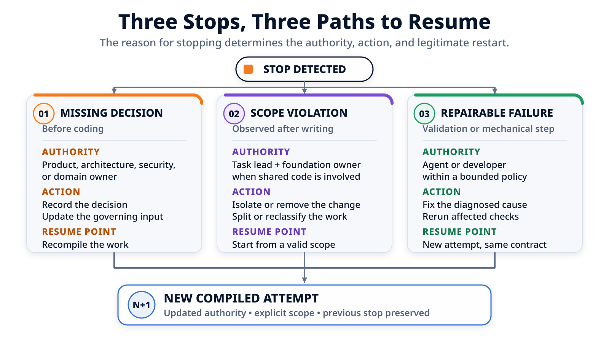

# Quand la tâche doit s'arrêter : décisions, frontières et reprise { .article-title }

Le paquet de pagination a produit les cinq fichiers attendus, les tests backend passent et le frontend compile. Pourtant, un test révèle que le bouton « Suivant » reste actif sur la dernière page. Faut-il recommencer, demander une décision humaine ou réparer localement ? Suivons les faits jusqu'au point exact de reprise.
{ .article-lead }

<p class="article-meta">
  <span>Par <span class="article-author">Vincent El Kouby-Benichou</span>, <a class="article-company-link" href="https://baracoda.com">Baracoda</a></span>
  <a class="article-contact-link" href="https://www.linkedin.com/in/vincentelkoubybenichou/">LinkedIn</a>
</p>

Dans [l'article précédent](../agent-execution-package/index.md), le brief, le plan, les règles du repository et les décisions humaines ont été compilés dans un ordre de mission. Le runner a reçu un bloc cohérent de trois tâches : faire évoluer l'API, adapter l'annuaire, puis vérifier leur cohérence.

Il est temps de laisser ce paquet s'exécuter. La première tentative ne se termine ni par un succès complet, ni par une catastrophe. Elle s'arrête sur un défaut précis, dans une zone autorisée, avec un test capable de vérifier la correction.

C'est le cas idéal pour comprendre la reprise. Un simple « continue » serait trop vague. Rejouer toute la feature gaspillerait le travail déjà accompli. Ignorer le test rouge serait évidemment faux. Le workflow doit qualifier l'arrêt, conserver la première tentative et construire une seconde mission plus étroite.

> Reprendre ne signifie pas recommencer. Cela signifie repartir du dernier état connu avec la même autorité, un diagnostic précis et des contrôles à refaire.

<figure class="article-diagram">
  
  <figcaption>La tentative 002 reprend l'échec de validation ; une décision manquante ou une frontière franchie imposerait un autre chemin.</figcaption>
</figure>

## Le paquet démarre depuis un état connu

Le point de départ n'est pas « le repository à peu près comme hier ». Le workflow relève un état précis avant de lancer le runner :

```yaml
depart:
  branche: feature/customer-pagination
  revision: 7a31c42
  copie_de_travail: propre

paquet:
  taches: [T-01, T-02, T-03]
  ecriture_autorisee:
    - backend/customers/**
    - frontend/customers/**
  lecture_seule:
    - shared/routing/**
  non_objectifs:
    - synchroniser la page dans l'URL
    - modifier une primitive partagée
```

Cette capture donne trois repères utiles pour la suite. La branche et la révision identifient la base locale. La copie de travail propre évite de confondre une modification antérieure avec celle du runner. Enfin, le paquet rappelle que `shared/routing/**` peut être consulté, mais pas modifié.

Cela ne transforme pas le paquet en sandbox. Le processus peut encore écrire dans un mauvais dossier si l'environnement lui en donne techniquement la possibilité. Les frontières déclarent l'autorité de la mission ; le contrôle de chemins vérifiera ensuite si les modifications observées la respectent.

## Tentative 001 : cinq fichiers attendus, un test rouge

Le runner exécute le bloc `T-01 → T-02 → T-03` dans une même session et déclare les trois tâches terminées. Le workflow ne prend pas cette déclaration pour une validation. Il inspecte d'abord Git.

Cinq chemins ont changé depuis l'état de départ :

```text
backend/customers/api.py
backend/customers/tests/test_pagination.py
frontend/customers/customer-api.ts
frontend/customers/customer-list.tsx
frontend/customers/customer-list.test.tsx
```

Ils appartiennent tous aux deux zones produit autorisées. Le contrôle de frontières réussit. Les trois commandes ciblées peuvent alors être lancées :

| Contrôle | Code de retour | Fait établi |
| --- | ---: | --- |
| `make test-back` | `0` | Les tests backend sélectionnés n'ont pas détecté d'échec |
| `make test-front` | `1` | Au moins un scénario frontend a échoué |
| `make build-front` | `0` | Le build frontend demandé s'est terminé sans erreur |
| Qualité globale | Non exécutée | Aucune conclusion sur ce contrôle |

Le détail utile se trouve dans la sortie de `make test-front` :

```text
FAIL CustomerList > disables Next on the last page

Expected: disabled
Received: enabled
```

La pagination sait charger des données et l'application compile, mais l'utilisateur peut encore demander une page située après la dernière. Les deux commandes vertes ne compensent pas cette divergence avec le comportement attendu.

Le résultat de la tentative doit donc rester explicite :

```yaml
tentative: "001"
resultat_runner_declare: completed
frontieres: passed
validations:
  "make test-back": passed
  "make test-front": failed
  "make build-front": passed
qualite_globale: not_run
statut: needs_retry
```

Cette distinction est importante. Le runner a bien terminé ce qu'il pensait devoir faire. Le workflow, lui, a observé que l'ordre de mission n'est pas encore satisfait.

## Pourquoi cet échec est réparable sans décision humaine

Avant d'autoriser une nouvelle tentative, il faut regarder la correction nécessaire, pas seulement la couleur du test.

Ici, quatre faits sont déjà connus :

1. le résultat attendu est explicite : « Suivant » doit être désactivé sur la dernière page ;
2. l'échec est localisé dans le comportement de `CustomerList` ;
3. la correction peut rester dans `frontend/customers/**` ;
4. elle ne demande ni nouvelle dépendance, ni changement de contrat, ni arbitrage produit.

Une cause plausible est que le composant détermine la dernière page à partir des éléments visibles au lieu d'utiliser le total renvoyé par l'API. La correction peut rester très petite :

```diff
- disabled={items.length === 0}
+ disabled={page * pageSize >= total}
```

Ce diff est un exemple d'implémentation, pas la conclusion du diagnostic. Ce qui autorise le retry est plus général : l'objectif et l'autorité ne changent pas, le défaut possède un signal de validation reproductible et la réparation reste dans le périmètre initial.

Nous sommes face à un **échec réparable**. L'agent peut intervenir dans une politique de reprise bornée. Si le correctif exigeait finalement une nouvelle règle produit, un changement du contrat backend ou une primitive partagée, la catégorie devrait changer et la tentative s'arrêter.

## Le point exact de reprise

Le workflow ne renvoie pas au runner « la pagination ne marche pas, réessaie ». Il prépare un contexte de reprise à partir de la tentative 001 :

```yaml
reprise:
  depuis_tentative: "001"
  depuis_la_porte: validation_ciblee
  controle_en_echec: "make test-front"

  diagnostic:
    test: "CustomerList > disables Next on the last page"
    attendu: disabled
    observe: enabled

  correction_autorisee:
    - frontend/customers/customer-list.tsx

  etat_conserve:
    - le diff produit par la tentative 001
    - le brief et les décisions existantes
    - les frontières d'écriture initiales
    - les sorties des validations déjà lancées

  validations_a_relancer:
    - "make test-back"
    - "make test-front"
    - "make build-front"
```

Le point de reprise est donc la réparation du résultat frontend avant la porte de validation. Le backend n'est pas réimplémenté. Le plan produit n'est pas recalculé. La copie de travail n'est pas remise arbitrairement à `7a31c42` : elle contient toujours les cinq fichiers de la tentative 001, dont la nouvelle tentative va modifier une partie.

Les trois commandes sont néanmoins relancées. `make test-front` doit vérifier le défaut corrigé. `make build-front` doit vérifier que la modification compile toujours. `make test-back` confirme que l'ensemble ciblé retenu pour ce paquet reste vert. Une équipe pourrait choisir une sélection différente, mais cette sélection doit être écrite avant de présenter la reprise comme validée.

## Tentative 002 : un fichier réparé, trois contrôles verts

La seconde tentative modifie uniquement :

```text
frontend/customers/customer-list.tsx
```

Cette liste décrit le **delta de la tentative 002**. Elle ne remplace pas le diff global de la feature, qui contient toujours les cinq fichiers observés après la première exécution.

Le contrôle de frontières est relancé, puis les trois commandes ciblées retournent `0` :

```yaml
tentative: "002"
derive_de: "001"
fichiers_changes_pendant_la_reparation:
  - frontend/customers/customer-list.tsx

frontieres: passed
validations:
  "make test-back": passed
  "make test-front": passed
  "make build-front": passed
qualite_globale: not_run
statut: completed
```

Le paquet peut maintenant être transmis à la revue locale. Il ne faut pas traduire ce statut par « la feature est correcte » ou « elle est prête à merger ». Nous savons que les cinq chemins restent dans l'enveloppe autorisée et que les trois commandes ciblées ont réussi sur l'état local de la tentative 002. Nous savons aussi que le contrôle qualité global n'a pas été lancé.

Surtout, la tentative verte n'efface pas la rouge :

| Tentative | État observé | Modification propre à la tentative | Résultat |
| --- | --- | --- | --- |
| `001` | Départ propre sur `7a31c42`, puis cinq fichiers produit | Implémentation du paquet | `make test-front` en échec, `needs_retry` |
| `002` | Diff de `001` conservé | `customer-list.tsx` | Trois validations ciblées réussies |

Cette histoire permet de comprendre pourquoi une correction a été nécessaire et ce qui a réellement été revérifié.

## Même test rouge, mais décision manquante

Le retry précédent était légitime parce que le mot **désactivé** figurait déjà dans le comportement attendu. Imaginons maintenant un brief moins précis : « empêcher l'utilisateur de dépasser la dernière page ».

Deux interfaces respectent cette phrase : masquer le bouton « Suivant », ou le conserver visible en le désactivant. Ce choix affecte la stabilité de la mise en page, la compréhension de la navigation et son comportement d'accessibilité. Un agent ne devrait pas transformer ce silence en préférence de design.

Le workflow conserve alors une intervention :

```markdown
# Intervention UI-01

Problème : le comportement de « Suivant » sur la dernière page n'est pas défini.

Options :
1. conserver le bouton visible et le désactiver ;
2. masquer le bouton.

Autorité attendue : produit et design.
Éléments affectés : critère de navigation, T-02 et test frontend.
Point de reprise : mettre à jour le critère et le test, puis recompiler la réparation.
```

Tant que la réponse manque, une nouvelle tentative de code serait prématurée. Lorsque la personne habilitée choisit « visible et désactivé », la décision est enregistrée, le critère concerné est mis à jour et le prochain ordre de mission reçoit cette réponse.

Ce n'est pas un retry à contrat constant. Une entrée qui gouverne l'exécution vient de changer. Il faut donc **recompiler** le travail affecté avant de reprendre. Dans notre scénario principal, cette intervention n'existe pas : le test de la tentative 001 montre que la décision était déjà prise.

## Même paquet, mais frontière franchie

Prenons une autre variante. En cherchant à corriger la navigation, l'agent décide aussi de persister la page dans l'URL et crée :

```text
shared/routing/customer-page.ts
```

Le choix peut sembler techniquement cohérent. Il viole pourtant deux éléments explicites de l'ordre de mission : `shared/routing/**` est en lecture seule et la synchronisation URL est un non-objectif.

Le contrôle de chemins observe alors six fichiers au lieu des cinq chemins produit attendus :

```yaml
frontieres:
  statut: failed
  violation:
    chemin: shared/routing/customer-page.ts
    regle: read_only

validations:
  "make test-back": skipped_due_to_boundary
  "make test-front": skipped_due_to_boundary
  "make build-front": skipped_due_to_boundary
```

Les validations prévues par le workflow ne sont pas lancées après l'échec de cette porte. Même si le runner affirme avoir testé son code, un vert fonctionnel ne donnerait pas rétroactivement à la tâche produit le droit de modifier le routage partagé.

Cette variante n'ouvre pas automatiquement une question d'architecture. La décision existante suffit : la synchronisation URL reste hors périmètre. La reprise normale consiste à consigner la violation, retirer ou isoler la modification attribuable à la tentative, puis préparer une réparation dans les zones produit.

Si le besoin produit changeait réellement, l'équipe pourrait ouvrir séparément une **évolution du socle** avec ses propres consommateurs, validations et autorité de revue. Elle ne devrait pas élargir après coup le paquet qui a franchi sa frontière.

## Réessayer, recompiler et reclasser : trois reprises différentes

Les trois branches du même exemple produisent maintenant une règle concrète :

| Situation | Ce qui change | Autorité nécessaire | Point de reprise |
| --- | --- | --- | --- |
| Test frontend réparable | Le code, dans le contrat existant | Agent ou développeur, dans un budget borné | Corriger depuis la validation rouge, puis relancer les contrôles concernés |
| Comportement de « Suivant » indéfini | Un critère d'acceptation | Produit et design | Enregistrer la décision, mettre à jour l'entrée, puis recompiler |
| `shared/routing/customer-page.ts` observé | Le diff a franchi une frontière | Pilote de la tâche ; propriétaire du socle seulement si un travail séparé est envisagé | Isoler ou retirer le changement, rétablir un périmètre valide, puis compiler une nouvelle tentative |

Un **retry** conserve l'objectif, les décisions et l'autorité. Une **recompilation** incorpore une entrée modifiée. Une **reclassification** crée un autre type de travail parce que la portée ou l'autorité nécessaire a changé.

Employer le même mot « reprise » pour ces trois opérations masque ce qui s'est réellement passé.

## Une boucle de réparation doit rester bornée

Une validation rouge n'autorise pas une suite illimitée de corrections. Chaque tentative doit conserver au minimum :

- la signature de l'échec initial ;
- le diagnostic proposé ;
- les actions entreprises ;
- les chemins touchés pendant la réparation ;
- les contrôles relancés et leurs résultats ;
- le budget de tentatives restant ;
- la prochaine action si le problème persiste.

Si `make test-front` échoue une seconde fois avec le même symptôme sans progrès observable, le workflow doit arrêter la boucle au seuil prévu. Il transmet les deux diagnostics et les deux diffs à un humain. Il ne doit ni multiplier les modifications, ni élargir les chemins pour « essayer autre chose ».

La catégorie peut aussi changer en cours de diagnostic. Si la correction du bouton exige finalement de modifier le contrat de l'API, la reprise n'est plus la petite réparation compilée ci-dessus. Si elle révèle un comportement produit non défini, elle devient une intervention. Si elle nécessite le routeur partagé, elle sort de l'autorité du paquet.

## Une frontière Git n'est pas une frontière de sécurité

Dans ce parcours, le contrôle compare la politique d'écriture avec les chemins observés après le passage du runner. Il peut empêcher qu'un résultat hors périmètre avance vers les validations et la revue. **Ce n'est pas un sandbox.**

Il ne prouve pas que le processus était incapable d'accéder au réseau, de lire un secret ou d'exécuter une commande dangereuse. Ces garanties relèvent des permissions du système, de l'isolation du processus, de la gestion des secrets et de la politique réseau.

La portée Git doit également être annoncée. Un contrôle fiable pour ce cas doit voir les fichiers suivis, les modifications indexées ou non indexées et le nouveau fichier non suivi `shared/routing/customer-page.ts`. Les renommages et les changements préexistants compliquent encore l'attribution.

Notre départ propre sur `7a31c42` rend la variante simple : le nouveau chemin n'existait pas avant la tentative. Dans une copie de travail déjà modifiée, le supprimer automatiquement pourrait détruire le travail de quelqu'un d'autre. Une restauration n'est raisonnable que si l'état de référence et la propriété des changements sont connus, et après avoir conservé le constat de violation.

Enfin, respecter les dossiers ne garantit pas la justesse métier. Le défaut du bouton « Suivant » se trouvait dans une zone parfaitement autorisée. Les frontières répondent à la question « où la tâche a-t-elle écrit ? », pas à la question « le comportement est-il correct ? ».

## Le dossier minimal d'arrêt et de reprise

Une équipe peut appliquer ce protocole avec une fiche courte, même sans orchestrateur complet :

```markdown
# Arrêt et reprise

Tentative :
État Git de départ :
Phase de détection :
Catégorie : décision manquante / frontière franchie / échec réparable

Faits observés :
-

Déclarations du runner :
-

Autorité nécessaire :
Décision ou diagnostic :
Point exact de reprise :
Chemins modifiables pendant la reprise :
Contrôles à relancer :
Tentatives précédentes à conserver :
Contrôles non exécutés :
Risque résiduel :
```

La fiche sépare les observations, les déclarations, l'autorité et les contrôles. Elle permet surtout à une nouvelle session de reprendre sans dépendre de la mémoire du chat précédent.

## Conclusion

La première tentative de la pagination ne demandait ni une nouvelle feature, ni une décision produit. Elle demandait une correction bornée : le comportement attendu était explicite, le défaut était local, les frontières avaient tenu et un test savait vérifier le résultat.

La tentative 002 est donc repartie de `make test-front` en échec, a modifié un seul fichier et a relancé `make test-back`, `make test-front` et `make build-front`. Elle n'a effacé ni la tentative 001, ni le contrôle global resté non exécuté.

Les variantes montrent pourquoi cette précision compte. Sans comportement décidé, il faut attendre l'autorité humaine et recompiler. Avec `shared/routing/customer-page.ts` dans le diff, il faut arrêter sur la frontière avant les validations. Dans aucun cas un simple « continue » ne décrit correctement la suite.

Nous disposons maintenant de deux tentatives locales : une rouge, puis une verte. Que permettent réellement d'affirmer leurs commandes, et à quel état du code s'appliquent-elles ? C'est le sujet de l'article suivant : [**« Les tests passent » : que prouve le workflow ?**](../local-proof-agent-workflow/index.md).

<div class="article-footer-contact">
  <p>Pour discuter de cet article ou me laisser un message public :</p>
  <a class="article-contact-link" href="https://github.com/velkouby/ai-based-development/issues/new?template=contact.yml">Message sur GitHub</a>
</div>
