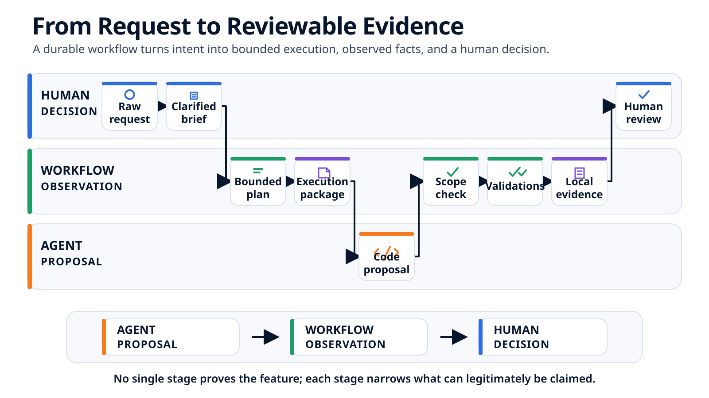

# From Brief to Local Review: An Agentic Feature, End to End { .article-title }

At 9:12, “add server-side pagination” is still a request. At 10:00, five files have changed, one attempt has failed, a bounded retry has passed, and a local review is ready. Let us follow every transformation between those two moments.
{ .article-lead }

<p class="article-meta">
  <span>By <span class="article-author">Vincent El Kouby-Benichou</span>, <a class="article-company-link" href="https://baracoda.com">Baracoda</a></span>
  <a class="article-contact-link" href="https://www.linkedin.com/in/vincentelkoubybenichou/">LinkedIn</a>
</p>

In the [previous article](../agent-coding-modes/index.md), server-side pagination for the customer directory was classified as a **Structured Feature** following an **orchestrated path**. The page size is 25, an invalid page returns HTTP 404 with the code `pagination_page_invalide`, and URL synchronization remains a non-goal.

Those decisions are now settled. This article starts from that record and follows the feature through planning, implementation, a failed validation, a retry, and local review.

The point is not to reproduce one particular tool. It is to make the handoffs visible. At every stage, we will ask the same three questions:

1. what enters the stage;
2. what durable output it produces;
3. what that output does—and does not—allow us to claim.

> The agent proposes and modifies. The workflow observes and records. A human decides whether the resulting facts are sufficient.

## 9:12 — Start from the Decision, Not from the Raw Request

The raw request is still useful:

> Add server-side pagination to the customer directory.

But it is no longer the only input. The decision record from the previous article adds the choices that the agent must not reinvent:

```markdown
Mode: Structured Feature
Path: orchestrated

Decisions:
- first page: 1;
- page size: 25 items;
- invalid page: HTTP 404, code pagination_page_invalide;
- page state: local to the feature.

Non-goals:
- synchronize the page with the URL;
- modify a shared primitive;
- add a dependency;
- migrate or restructure data.

Owners:
- feature owner;
- API owner.
```

This record does not say how to modify the code. It says which product and governance decisions have already been made. If URL synchronization becomes mandatory again, the feature must stop and return to the appropriate owner instead of silently changing `shared/routing/**`.

## 9:20 — Turn the Decision into an Observable Brief

The brief now translates those decisions into behavior that can be reviewed:

```markdown
## Objective

Paginate the customer directory on the server and let users move
between pages from the interface.

## Observable outcomes

- GET /api/customers?page=2 returns items, page, and total;
- the directory loads page 1 when it opens;
- Previous is disabled on page 1;
- Next is disabled when the total has been reached;
- loading, empty, and error remain distinct states;
- an invalid page returns HTTP 404 with pagination_page_invalide.

## Write scope

- backend/customers/**
- frontend/customers/**

## Read-only context

- docs/customers/pagination.md
- shared/ui/**
- shared/state/**
- shared/routing/**

## Stop if

- an existing consumer requires an incompatible contract;
- a product or authorization decision remains open;
- a shared primitive, dependency, or migration becomes necessary;
- one of the non-goals cannot be respected.
```

The brief names behavior and boundaries, not every edit. It is precise enough to test, while still leaving the coding agent room to explore the authorized areas and plan the implementation details.

At this point, we know **what must be true**. We still need executable units of work.

## 9:28 — Break the Feature into Three Bounded Tasks

“Do the backend, then the frontend, then test everything” is not yet an executable plan. Each task needs an observable result, dependencies, writable paths, and a validation.

| Task | Observable result | Depends on | Writable files | Declared validation |
| --- | --- | --- | --- | --- |
| T-01 — API contract | Return `items`, `page`, and `total`; cover page boundaries and the 404 convention | — | `backend/customers/api.py`<br>`backend/customers/tests/test_pagination.py` | `make test-back` |
| T-02 — Interface | Send the requested page; preserve existing states; enforce Previous and Next boundaries | T-01 | `frontend/customers/customer-api.ts`<br>`frontend/customers/customer-list.tsx`<br>`frontend/customers/customer-list.test.tsx` | `make test-front` |
| T-03 — Integration review | Compare the frontend consumer with the backend contract and confirm that no URL synchronization was introduced | T-01, T-02 | No additional product-code write expected | `make build-front` |

This breakdown does several useful things at once:

- T-02 cannot invent a contract before T-01 stabilizes it;
- T-03 cannot hide new implementation work inside a vague “integration” task;
- the five expected product files are visible before execution;
- every task has a result that can be distinguished from “the agent says it is done.”

The commands are **declared validations**. Their presence in the plan does not mean they have run. That fact can exist only after execution, with an exit code and captured output.

## The Trace We Are About to Produce

The complete path now has a concrete timeline.

| Time | Transformation | Durable output |
| --- | --- | --- |
| 9:12 | Qualify the request | Decision record |
| 9:20 | Clarify expected behavior | Feature brief |
| 9:28 | Break down the work | Plan and T-01 to T-03 |
| 9:34 | Compile executable context | Execution package for the task block |
| 9:43 | Run the first attempt | Runner result, Git observations, and failed validation |
| 9:48 | Prepare a bounded retry | Retry record linked to attempt 001 |
| 9:54 | Run the second attempt | Passing targeted validations and final local evidence |
| 10:00 | Assemble the facts | Local review summary |

<figure class="article-diagram">
  
  <figcaption>Each handoff adds one limited kind of information; no single stage proves that the feature should be merged.</figcaption>
</figure>

## 9:34 — Compile One Coherent Task Block

T-01, T-02, and T-03 share the same pagination contract and form one dependency chain. They can therefore be prepared as one coherent block for a single runner session:

```text
T-01 backend contract
  -> T-02 frontend consumer
    -> T-03 consistency review

one shared context load
one ordered task block
one distinct result required for each task
```

The package combines two layers:

- **shared context:** brief, decisions, repository rules, write-boundary matrix, and starting Git state;
- **task context:** expected outcome, dependencies, exact writable files, read-only references, validation, and stop conditions.

Just before the runner starts, the local state is recorded:

```text
branch: feature/customer-pagination
HEAD: 7a31c42
staged files: none
unstaged files: none
untracked files: none
observed at: 09:38
```

Starting from a clean tree will later make attribution easier: any observed product-code change appeared after this snapshot. It still does not prove which task or process wrote each line.

Loading the shared context once avoids repeating the brief and repository rules for every micro-task. The workflow plans the block; the coding agent plans the detailed edits inside that block. The next article will open this package field by field.

## 9:43 — Attempt 001: Separate the Agent's Report from Git

The runner completes its session and returns a structured declaration:

```yaml
package_status: completed
task_results:
  - {id: T-01, status: completed}
  - {id: T-02, status: completed}
  - {id: T-03, status: completed}
declared_changed_files:
  - backend/customers/api.py
  - backend/customers/tests/test_pagination.py
  - frontend/customers/customer-api.ts
  - frontend/customers/customer-list.tsx
  - frontend/customers/customer-list.test.tsx
open_questions: []
blockers: []
```

This is useful, but it is still an **agent declaration**. The workflow then inspects the complete working tree independently. In this attempt, Git shows the same five files, all unstaged and none untracked.

| Observation | Result |
| --- | --- |
| Files declared by the agent | Five product files |
| Files observed from Git | The same five product files |
| Branch observed after the runner | `feature/customer-pagination` |
| HEAD observed after the runner | `7a31c42`, unchanged; the diff is not committed |
| Files outside `backend/customers/**` or `frontend/customers/**` | None |
| Read-only paths modified | None |
| Tooling, generated files, or workflow state modified by the runner | None |
| Package boundary check | Passed |

The agreement between the two lists is useful. It does not transform the agent's per-task attribution into an observed fact. Without intermediate snapshots, Git establishes what changed during the package, not whether T-01 or T-02 produced a particular line.

## 9:44 — Check the Scope Before Running Validations

The order of the gates matters:

```text
runner result complete
  -> expected task results present
    -> Git state inspected
      -> write boundaries passed
        -> declared validations may run
```

Running tests first could produce a misleading green result if the feature worked only because the runner had modified `shared/routing/**`. Path checks happen after writing and do not create a sandbox, but they can prevent an out-of-scope result from being accepted or validated further.

Here, the five observed paths are authorized, so the workflow runs all three declared commands and records every result independently.

## 9:46 — One Red Validation Overrides “Completed”

Attempt 001 produces this table:

| Command | Exit code | Relevant result |
| --- | ---: | --- |
| `make test-back` | 0 | Pagination API tests pass |
| `make test-front` | 1 | `CustomerList > disables Next on the last page`: expected disabled, received enabled |
| `make build-front` | 0 | The frontend production build completes |
| Global quality profile | Not run | No conclusion is available for this profile |

The package was declared `completed`, the paths are compliant, and the build succeeds. The attempt still fails because one required validation returned a nonzero exit code.

This is exactly why the layers must remain separate:

- the agent says the three tasks are complete;
- Git shows that the five authorized files changed;
- two commands return 0;
- one command returns 1;
- the workflow records `needs_retry`;
- no human has accepted the behavior.

A summary that collapses this into “implementation completed” would be false. A summary that says “the feature is broken” would also go too far: one local test exposed one concrete defect in this attempt.

## 9:48 — Compile a Bounded Retry

The failing output points to one behavior: the interface does not disable **Next** on the last page. The retry does not reopen the whole feature.

```yaml
resume_from: attempt-001
reason: validation_failure
failing_validation: make test-front
failure: "Expected Next to be disabled on the last page; received enabled."
authorized_focus:
  - frontend/customers/customer-list.tsx
unchanged_boundaries:
  writable:
    - backend/customers/**
    - frontend/customers/**
  read_only:
    - shared/ui/**
    - shared/state/**
    - shared/routing/**
rerun:
  - make test-back
  - make test-front
  - make build-front
```

The agent corrects the boundary calculation to use the current page, page size, and `total`, rather than merely checking whether the current response contains items. During attempt 002, Git observes a new change only in `frontend/customers/customer-list.tsx`; the final working tree still contains the same five product files.

All boundaries are checked again. Then all declared validations are rerun:

| Command | Attempt 001 | Attempt 002 |
| --- | ---: | ---: |
| `make test-back` | 0 | 0 |
| `make test-front` | 1 | 0 |
| `make build-front` | 0 | 0 |
| Global quality profile | Not run | Not run |

The retry does not erase the failed attempt. Attempt 001 explains why the work resumed; attempt 002 records what changed and which commands now pass. Keeping both is what makes the path reconstructible.

## 9:54 — Write Evidence for the Attempt, Not a Success Slogan

The resulting local artifact can be compact:

```yaml
feature: customer-pagination
base:
  branch: feature/customer-pagination
  commit: 7a31c42
  working_tree: clean

attempts:
  - id: attempt-001
    agent_status: completed
    path_policy: passed
    validations: failed
    stop_reason: validation_failure
  - id: attempt-002
    agent_status: completed
    path_policy: passed
    validations: passed

final_observation:
  branch: feature/customer-pagination
  head: 7a31c42
  head_changed_since_start: false
  changed_files: 5
  staged_files: 0
  untracked_files: 0
  targeted_validations: "3 of 3 passed on attempt-002"
  global_quality: not_run

limits:
  - "Local working-tree evidence, not yet bound to a head commit."
  - "No conclusion about the global quality profile."
  - "Business acceptance and merge decision remain human."
```

This artifact supports precise statements: the observed final paths are within scope; the three targeted commands returned 0 on attempt 002; the first attempt failed for a recorded reason. It does not establish sufficient coverage, product correctness, or readiness to merge.

## 10:00 — Prepare a Review Without Making the Decision

The local review now assembles the facts without flattening their provenance:

```markdown
## Scope
Five observed product files; no read-only or forbidden path modified.

## Execution
Attempt 001 failed on the last-page Next-button behavior.
Attempt 002 applied a bounded frontend correction.

## Validations
- make test-back: passed on attempt 002;
- make test-front: passed on attempt 002;
- make build-front: passed on attempt 002;
- global quality profile: not run.

## Still requires human review
- contract shape and compatibility with known consumers;
- behavior against the acceptance criteria;
- relevance of the tests and residual edge cases;
- decision to commit, open a PR, or request more work.
```

A reviewer can now understand the path without reopening the agent conversation. They still need to inspect the diff, evaluate the implementation choices, and decide whether the missing global check is acceptable at this stage.

## Local Review Is Not Yet a Pull Request

The path deliberately stops before commit and CI:

```text
local attempts and evidence
  -> human-reviewed diff
  -> identified commit
  -> CI results on that commit
  -> pull request discussion
  -> merge decision
```

The local artifact is tied to a branch, a base commit, and a mutable working tree. CI will add a defined environment and a revision identity. Neither layer replaces human acceptance.

## Reproduce the Same Path with Simple Tools

The essential protocol does not require a complete orchestration platform. A team can begin with versioned files and stable scripts:

1. retain the request and the decision record;
2. write a brief with observable outcomes and non-goals;
3. create tasks with dependencies, writable paths, and validations;
4. record the complete Git state before execution;
5. give the agent one coherent, bounded task block;
6. require structured results without treating them as observed facts;
7. compare the final Git state with the authorized paths;
8. run and record every declared validation only after the scope check;
9. preserve failed attempts and compile bounded retries;
10. prepare a review that exposes passed, failed, and missing checks separately.

The first gain is not autonomy. It is the ability to explain exactly where the feature is, why it stopped, and what must happen next.

## Conclusion

Our pagination feature did not travel directly from prompt to green tests. The decision became a brief, the brief became three tasks, the tasks became one execution package, and the first implementation became a failed but useful attempt. A bounded retry then produced three passing targeted validations and a reviewable five-file diff.

The resulting local evidence is stronger than an agent summary because it keeps declarations, Git observations, command results, and missing checks separate. It is still not a merge decision.

We can now stop the timeline at 9:34 and open the object handed to the runner: [**the execution package, its shared context, task cards, boundaries, and output contract**](../agent-execution-package/index.md).

<div class="article-footer-contact">
  <p>To discuss this article or leave me a public message:</p>
  <a class="article-contact-link" href="https://github.com/velkouby/ai-based-development/issues/new?template=contact.yml">Message on GitHub</a>
</div>
