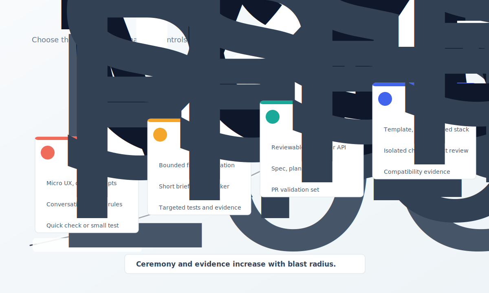

# AI agent-based coding : bonnes pratiques { .article-title }

Le vibe coding a montré que l’intention en langage naturel pouvait devenir une interface de développement. Mais pour produire du logiciel maintenable, seul ou en équipe, il faut plus qu’une conversation avec un agent : il faut assembler quatre briques simples — un repository agent-ready qui porte les règles, un workflow qui les applique, un plan qui compile le contexte utile et des preuves d’exécution qui rendent le travail reviewable.
{ .article-lead }

  Par Vincent El Kouby-Benichou
  <a class="article-contact-link" href="https://www.linkedin.com/in/vincentelkoubybenichou/">LinkedIn</a>

Le développement logiciel avec IA est souvent raconté comme une histoire individuelle. Un développeur ouvre un agent de code, décrit ce qu’il veut, laisse l’agent modifier la codebase, puis corrige ou valide. Cette boucle est réelle. Elle est même puissante. Elle explique pourquoi le vibe coding a capté autant d’attention : pour la première fois, l’intention exprimée en langage naturel devient une interface directe avec le système logiciel.

Mais cette description est incomplète.

Même quand on développe seul, on ne développe pas seulement dans une conversation. On développe dans un repository, avec une architecture, des conventions, des dépendances, des scripts, des tests, des commits, des décisions produit et une mémoire technique. Et dès que l’on travaille en équipe, cette réalité devient plus exigeante : le repository est partagé, les pull requests doivent être relues, les règles de review doivent être explicites, les contraintes de sécurité doivent être respectées et les décisions doivent survivre aux conversations individuelles.

Quand les agents de code entrent dans ce système, la vraie question n’est donc pas : « Quel prompt faut-il écrire ? » La vraie question est : **dans quel système l’agent doit-il travailler ?**

> L’enjeu de l’AI agent-based coding n’est pas d’allonger la conversation avec l’agent. Il est de mieux concevoir le système qui le guide, le limite et le vérifie.

Ce texte propose des éléments de méthode simple pour assembler des pratiques déjà visibles : repository agent-ready, workflow explicite, contexte sélectionné, tâches reviewables et preuves d’exécution. C’est cette combinaison qui rend le travail avec agents utilisable seul, puis partageable en équipe.

## Le vibe coding a raison sur l’intuition, mais tort sur l’industrialisation

Le vibe coding a révélé quelque chose d’important : une partie du logiciel ne se découvre pas par rédaction exhaustive de spécifications, mais par essai, observation, correction et conversation. C’est particulièrement vrai pour les prototypes, les détails d’interface, les ajustements UX, les explorations de workflows et les corrections rapides. Les travaux récents sur le sujet décrivent le vibe coding comme une pratique de co-création conversationnelle avec l’IA, liée au flow, à l’expérimentation et à la confiance accordée à l’agent. Ils identifient aussi ses fragilités : difficulté à formuler précisément l’intention, fiabilité variable, charge de review, debugging difficile et dérive du contexte. ([arXiv][1])

Il ne faut donc pas caricaturer le vibe coding comme une pratique immature à abandonner. Ce serait passer à côté de sa valeur. Le vibe coding est rapide parce qu’il laisse l’humain rester proche de l’intention et du résultat observable. Il réduit la friction initiale entre « j’ai une idée » et « je vois quelque chose fonctionner ».

Mais cette vitesse a un coût. Une revue de littérature sur les pratiques de vibe coding décrit un paradoxe speed-quality : les utilisateurs sont attirés par la vitesse et l’accessibilité, mais perçoivent souvent le code produit comme rapide et imparfait, avec des pratiques de QA fréquemment négligées. ([arXiv][2])

Le problème n’est pas que le vibe coding soit inutile. Le problème est qu’il devient fragile dès qu’il rencontre une vraie codebase. Une conversation ne porte pas naturellement les frontières d’architecture. Elle ne sait pas toujours distinguer un composant réutilisable d’un composant à ne pas toucher. Elle n’impose pas les validations. Elle ne produit pas toujours une trace exploitable en review. Elle ne garantit pas que deux développeurs utiliseront l’agent de la même manière.

> Le vibe coding produit de la vitesse. Le vibe coding sans frontières produit de la dette.

## Le repository doit devenir agent-ready

La première brique d’un développement AI-native industrialisable n’est pas le prompt. C’est le repository.

Un agent de code ne doit pas arriver dans un espace vague. Il doit arriver dans un environnement qui dit clairement où coder, comment coder, quoi réutiliser, quoi ne pas modifier, comment valider, comment prouver et quand s’arrêter.

Un repository agent-ready n’est pas seulement un repository bien documenté. C’est un repository dont les conventions humaines sont devenues actionnables par des agents. Il contient un template exécutable, un stack décidé par l’équipe, des scripts standards, des points d’extension identifiés, des zones protégées, des patterns réutilisables, des règles de test, des commandes de validation et une documentation opérationnelle pour les agents.

La nuance est importante. Beaucoup d’équipes ajoutent déjà des fichiers d’instructions pour les agents. C’est utile, mais insuffisant. Une règle écrite dans un fichier n’est pas une règle appliquée. Si le workflow repose sur la mémoire de l’agent, il finira par être oublié, contourné ou mal interprété.

L’émergence d’AGENTS.md va dans ce sens : proposer un endroit prévisible, proche d’un README pour agents, où placer les commandes de setup, les conventions, les règles de test ou les attentes de PR. Codex documente aussi l’usage de ces fichiers pour charger des instructions projet avant l’exécution. Mais ces fichiers ne doivent pas devenir des encyclopédies. Des travaux récents sur les context files montrent qu’ils peuvent augmenter le coût et parfois réduire le taux de réussite lorsqu’ils ajoutent trop d’exigences inutiles. La bonne direction n’est donc pas « plus d’instructions », mais « des instructions plus courtes, plus fiables et appliquées par le workflow ». ([AGENTS.md][11]) ([OpenAI Developers][12]) ([arXiv][13])

> Les docs agents décrivent les règles. Le workflow les applique. Le plan les transporte dans le contexte d’exécution.

Un agent ne doit pas inventer le stack à chaque feature. Il ne doit pas choisir une nouvelle librairie parce qu’elle lui semble pratique. Il ne doit pas recréer un composant déjà présent parce qu’il ne l’a pas retrouvé. Il ne doit pas corriger une demande métier en modifiant le socle technique. Il doit coder du produit dans le système que l’équipe a choisi.

Dans un monorepo, cette exigence devient encore plus forte. L’agent peut voir plusieurs mondes à la fois : frontend, backend, mobile, SDK, data, infra, documentation, scripts, librairies partagées. Cette visibilité est utile pour comprendre les contrats entre composants, mais elle augmente aussi le risque de modifications hors périmètre.

> Dans un monorepo agent-ready, l’agent peut voir tout le système, mais il ne peut pas tout traiter de la même manière.

## Séparer le socle technique du code produit

La séparation entre socle technique et code produit devient un principe central du développement AI-native.

Dans une codebase traditionnelle, cette séparation est déjà utile. Dans une codebase travaillée par agents, elle devient critique. Si un agent peut modifier indistinctement les primitives UI, les scripts, la configuration, les règles du repository, les composants de base et les features métier, chaque demande produit peut devenir une dette de plateforme et créer une dérive de la plateforme commune entre différents projets d'une meme équipe.

Il faut donc distinguer deux zones.

La première est la couche de fondation. Elle contient la structure du projet, les conventions, les composants de base, la configuration, les scripts, les workflows CLI, les règles agents, les mécanismes de validation, les capabilities réutilisables et la documentation technique. Cette couche change moins souvent, avec plus de contrôle.

La seconde est la couche produit. Elle contient les features métier, les écrans spécifiques, les domaines applicatifs, les API produit, les modèles métier, les prompts métier, les règles business, la documentation produit et les spécifications de feature. C’est la zone principale d’intervention quotidienne des agents.

La règle doit être simple :

> Si un changement peut être fait dans la couche produit, il ne doit pas être fait dans la couche fondation.

Cette séparation protège l’architecture. Elle permet aussi l’upgrade du socle. Un template ou une fondation technique ne peut évoluer proprement que si l’équipe sait encore quels fichiers appartiennent au framework et quels fichiers appartiennent au produit.

C’est précisément le type de frontière qu’un système de développement AI-native cherche à matérialiser : un socle full-stack propre, testable, documenté et upgradeable, avec une séparation stricte entre les chemins Forge-owned et Project-owned, un contrat machine, des validations, des preuves et un workflow durable indépendant de la mémoire du chat.

<figure class="article-diagram">
  
  <figcaption>Human + agent development system: humans steer, agents execute, and the workflow turns repository rules into verifiable execution.</figcaption>
</figure>

## Tous les changements ne méritent pas le même rituel

L’erreur inverse serait de répondre au chaos du vibe coding par une bureaucratie généralisée. Si chaque micro-changement devient une spec complète, une équipe tuera la vitesse qui rend les agents utiles.

Une méthode AI-native doit calibrer le niveau de structure selon l’impact réel du changement. Je vois quatre modes de développement.

Le premier mode est **foundation evolution**. Il concerne les changements de socle : nouveau template, nouvelle capability commune, évolution du design system, changement d’architecture backend, modification des règles agents, ajout d’un workflow CLI, changement des scripts de validation. Ce mode est risqué parce qu’il modifie les règles dans lesquelles les agents coderont demain. Cette foncdation est généralement commune à plusieurs projets, c'est le socle technique de l'équipe, il est recommandé de l'isoler.

> Modifier le socle, c’est modifier les règles selon lesquelles les agents coderont les prochaines features.

Le deuxième mode est **spec-driven feature**. Il concerne les features significatives : nouveau workflow métier, nouvelle API, nouvelle page complète, intégration entre plusieurs composants, traitement IA dans un pipeline, nouvelle capacité mobile, data ou infra. Ici, la spécification est utile parce qu’elle stabilise l’intention avant l’exécution. On entre alors dans un processus plus structuré, proche de ce que propose une méthode comme Spec Kit. Quand la feature est complexe, il vaut mieux itérer sur la specification que sur le code.

Le troisième mode est **guided coding**. Il couvre les besoins bornés mais non triviaux : connecter une donnée backend à une interface existante, ajouter une option à un traitement, corriger un bug reproductible avec test de non-régression, ajuster un flux IA existant. On ne lance pas toute une mécanique de spec, mais on produit un plan court, un tracker, un contexte propre et une validation ciblée.

> Le guided coding est le mode du brief court, du plan court et de l’exécution contrôlée.

Le quatrième mode est **vibe coding contrôlé**. Il reste adapté aux micro-ajustements : corriger un libellé, déplacer un bouton, améliorer un état vide, ajuster une couleur avec les tokens existants, tester une variante visible, améliorer un prompt métier. La conversation garde sa valeur, mais le périmètre doit rester local, réversible et soumis aux règles du repository.

> Le vibe coding garde sa valeur quand il reste local, réversible et soumis aux règles du repository.

<figure class="article-diagram">
  
  <figcaption>Four agent coding modes calibrated by scope, risk, ceremony, and evidence.</figcaption>
</figure>

Ces modes ne s’opposent pas. Ils forment une échelle. Plus le changement est transversal, durable ou risqué, plus il doit remonter vers des modes structurés. Plus il est local, observable et réversible, plus il peut descendre vers des modes légers. Et souvent, on utilise du **vibe coding contrôlé** après une phase de **guided coding** ou de **spec-driven feature**, au sein du même contexte, afin d’ajuster et de finaliser une feature.

> Une méthode AI-native n’impose pas le même rituel à toutes les tâches. Elle impose le bon niveau de rituel à chaque type de changement.

## Le spec-driven est nécessaire, mais pas universel

Le développement par spécification est une avancée importante pour les agents de code. GitHub a présenté Spec Kit comme un toolkit open source pour introduire un processus structuré dans les workflows d’agents de code, notamment autour des étapes de spécification, planification, découpage en tâches et implémentation. ([The GitHub Blog][3])

La documentation de Spec Kit positionne le spec-driven development comme une méthode qui place la spécification au centre du développement assisté par IA : on décrit ce qu’il faut construire, on affine à travers des phases structurées, puis l’agent implémente. ([GitHub Pages][4]) Le repository Spec Kit décrit aussi un workflow dans lequel l’implémentation vérifie la présence des prérequis — constitution, spec, plan et tâches — avant d’exécuter les tâches dans l’ordre prévu. ([GitHub][5])

Cette approche répond à une faiblesse évidente du vibe coding : l’intention change, se dilue ou reste implicite. La spec devient alors un artefact vivant. Elle clarifie le problème utilisateur, le résultat attendu, les règles métier, les interactions et les critères de succès. Le plan traduit ensuite cette intention dans les contraintes du projet : architecture, stack, sécurité, performance, design system, chemins autorisés, tests et validations.

Mais le spec-driven ne doit pas devenir une réponse universelle. Une spec n’est pas gratuite. Elle consomme du temps, du contexte, des tokens, de la review et de l’attention. Elle peut devenir disproportionnée pour une correction locale ou une itération rapide. Elle peut aussi devenir ingérable si la feature est trop large et que l’on tente de compenser par une checklist géante.

La règle opérationnelle devrait être plus simple :

> Une feature AI-native doit correspondre à une branche, une PR, une spec courte, un plan, une liste linéaire de tâches, des validations et des preuves.

Autrement dit, la bonne unité de travail reste **la feature reviewable**. On en revient aux mêmes constats que dans le développement logiciel classique. Si le besoin ne tient pas dans une branche et une PR lisible, ce n’est pas le workflow qu’il faut complexifier. C’est le besoin qu’il faut découper.

## Le plan devient le compilateur de contexte

Le repository impose la structure et les règles du projet. La spécification et le plan stabilisent l’intention. Reste une question plus opérationnelle : comment faire respecter tout cela aux agents au moment de l’exécution ?

Le grand sujet du développement AI-native n’est pas le prompt engineering. C’est le context engineering : sélectionner, compresser et organiser ce que l’agent voit, au lieu d’empiler toujours plus d’informations dans la fenêtre de contexte. Cette évolution est aussi décrite par Martin Fowler et Thoughtworks comme un sujet central des coding agents. ([Martin Fowler][15])

Un agent ne doit pas relire tout le repository pour chaque tâche. Il ne doit pas recevoir un dump massif de documentation, de fichiers, de conventions et de fragments de conversation. Il doit recevoir le bon contexte au bon moment.

C’est ici que le plan de développement, tel qu’il apparaît dans les approches spec-driven, change de nature. Il ne doit pas être une simple checklist. Il doit devenir aussi un compilateur de contexte.

Le plan compile deux types de contexte.

D’abord, le contexte de workflow : mode de développement choisi, étapes obligatoires, tracker à maintenir, validations attendues, preuves à produire, conditions d’arrêt, règles de reprise, format du résumé d’exécution.

Ensuite, le contexte de repository : architecture concernée, chemins autorisés, chemins protégés, patterns à réutiliser, composants existants, conventions de test, commandes de validation, dépendances autorisées ou interdites.

Cette logique rejoint une tendance plus large des outils d’agents de code. Dans son analyse de la boucle agentique de Codex, OpenAI décrit le rôle du harness comme l’orchestration entre l’utilisateur, le modèle et les outils mobilisés pour produire un travail logiciel réel, avec gestion du contexte, des instructions et des appels outils. ([OpenAI][6]) Les Codex Skills vont dans le même sens : ils utilisent une logique de progressive disclosure, où l’agent ne charge les instructions complètes d’une compétence que lorsqu’il décide qu’elles sont nécessaires. ([OpenAI Developers][7])

Le principe est fondamental : le contexte ne doit pas être accumulé sans limite. Il doit être sélectionné, compressé, structuré et rendu opérationnel.

> Le bon contexte agentique n’est pas un résumé du repository. C’est un ordre de mission dérivé du plan.

Un task packet devrait contenir seulement ce dont l’agent a besoin pour exécuter une tâche : objectif, périmètre, chemins autorisés, chemins interdits, fichiers probablement concernés, patterns à réutiliser, commandes de validation, critères de fin, conditions d’arrêt et preuves attendues.

> Le plan est l’endroit où l’on transforme les règles générales du projet en contexte spécifique pour une exécution agentique.

Les travaux sur Spec Kit Agents pointent le même problème sous un autre angle : dans de grands repositories, les agents deviennent facilement « context blind », hallucinent des API ou violent des contraintes d’architecture. Leur réponse consiste à ajouter des hooks de grounding et de validation à chaque phase du workflow, afin d’ancrer les décisions dans des preuves du repository. ([arXiv][17])

## Le workflow doit appartenir au système, pas à la mémoire de l’agent

On ne doit pas demander à un agent de se souvenir de toute la méthode pendant plusieurs heures. Le workflow doit être codé dans un système externe : une CLI, un orchestrateur local, un pipeline ou des scripts.

L’agent exécute. Le système orchestre et vérifie.

Cette distinction est décisive. Un agent peut proposer un plan, modifier le code, lancer des commandes, expliquer ses décisions et produire une synthèse. Mais il ne doit pas être le seul juge de sa propre exécution. Il peut oublier une étape, déclarer trop tôt que tout est terminé, ne pas lancer les tests, modifier une zone interdite, perdre la cohérence du tracker ou produire un résumé plus optimiste que la réalité.

Un workflow CLI doit donc créer l’unité de travail, sélectionner le mode de développement, enregistrer le brief, générer ou valider la spec si nécessaire, produire le plan, créer le tracker, compiler les task packets, appeler le runner agentique, contrôler les fichiers modifiés, vérifier les chemins interdits, lancer ou demander les validations, enregistrer les preuves, mettre à jour l’état machine et préparer la synthèse de PR.

Codex CLI illustre bien le rôle possible d’un runner local : la documentation OpenAI le décrit comme un agent de code exécutable depuis le terminal, capable de lire, modifier et exécuter du code sur la machine dans le répertoire sélectionné. ([OpenAI Developers][8]) Mais le runner ne doit pas porter toute la méthode. Codex, Claude Code, Copilot, Gemini CLI ou d’autres agents peuvent changer. Le repository et le workflow doivent rester.

C’est aussi le sens du harness engineering : traiter le repository comme un système de connaissance structuré, donner à l’agent une carte plutôt qu’un manuel de mille pages, et placer les règles dans un environnement que le workflow peut exploiter. ([OpenAI][14])

> Le modèle peut changer. Le repository et le workflow restent. La méthode doit donc appartenir au système de développement, pas au modèle.

## La preuve devient un artefact de développement

Dans le développement AI-native, la preuve ne doit pas être réduite aux logs de tests ou aux sorties de commandes. Elle devient l’ensemble des artefacts qui relient l’intention initiale, le plan d’exécution, les tâches réalisées, les validations obtenues et le comportement effectivement livré.

Une feature peut commencer par une spécification complète, un plan court de guided coding ou un patch conversationnel contrôlé. Mais au moment du merge, elle doit se fermer avec une trace claire : ce qui était demandé, ce qui a été planifié, ce qui a été fait, ce qui a changé en cours de route, ce qui a été validé et ce qui est finalement livré.

Dans un processus spec-driven, la spécification initiale n’est donc pas le dernier mot. Elle est une hypothèse de départ. Pendant l’exécution, le plan peut évoluer, des corrections guidées peuvent être ajoutées, des ajustements locaux peuvent finaliser la branche. La PR doit alors produire ou mettre à jour une spécification finale : non pas la spec idéale du début, mais la description fidèle du système réellement mergé.

La spécification initiale exprime l’intention. La spécification finale décrit le produit livré.

Cette logique ne remplace pas Git. Elle le renforce. GitHub décrit les pull requests comme un mécanisme central de collaboration permettant de proposer, discuter et relire des changements avant merge, afin d’aider les équipes à travailler ensemble, détecter les problèmes et maintenir la qualité. ([GitHub Docs][9]) Dans un workflow AI-native, la branche devient l’espace d’exécution, et la PR devient le point de convergence entre code, plan, preuves, décisions, validations et spécification finale.

Ces artefacts ont deux publics. Pour les humains, ils expliquent ce qui a été fait sans relire toute la conversation avec l’agent : brief, plan, décisions, écarts, validations, synthèse de PR, spécification finale. Pour la CLI, ils structurent l’exécution : fichiers de tracking, état des tâches, phases du plan, chemins autorisés, validations attendues, preuves enregistrées.

Le plan porte le contexte. Le tracker porte l’état. Le prompt déclenche l’exécution.

Une tâche agentique ne devrait donc pas être lancée avec un simple « continue la feature ». Elle devrait être située dans un plan, une phase, une branche, un fichier de tracking, un périmètre et des validations attendues. C’est cette trace qui rend le travail auditable, reprenable et reviewable.

Le développement AI-native ne doit pas seulement produire du code. Il doit produire la mémoire vérifiable de sa propre exécution.

Cette idée rejoint des travaux récents qui formalisent le passage du vibe coding à une ingénierie vérifiée comme un problème de process control : spécifier, contraindre, orchestrer, prouver et vérifier, plutôt que seulement améliorer les prompts. ([arXiv][16])

## La granularité est aussi un problème économique

Dans les approches spec-driven, la taille des tâches n’est pas seulement une question méthodologique. C’est une question économique.

Une tâche trop petite coûte cher en contexte, orchestration, validation et reprise. Une tâche trop grande augmente le risque de dérive, de diff illisible, de dette cachée et de review impossible.

Le bon batch doit être assez large pour amortir le coût de contexte, assez cohérent pour rester dans une seule intention, assez borné pour tenir dans une PR et assez vérifiable pour produire des preuves solides.

Trop gros : « refaire toute l’application, ajouter les permissions, changer le design system et migrer la base ».

Trop petit : « créer le fichier vide du composant bouton de filtre ».

Bonne granularité : « implémenter la liste clients avec chargement API, états vide/erreur/loading, pagination et tests de rendu, en utilisant les composants existants ».

La granularité devient le paramètre économique central parce qu’elle détermine le coût en tokens, le coût en temps, le coût de validation, le coût de review humaine, le risque de divergence, la fatigue cognitive, le coût de reprise et le coût d’intégration.

> La granularité est le paramètre économique central du développement avec agents.

## Une méthode simple pour l’AI agent-based coding

Aller vers un développement AI-native de manière industrielle, ce n’est pas annoncer que les agents écriront demain tout le logiciel. C’est plus concret et plus utile : définir une méthode simple pour travailler avec des agents sans perdre la maîtrise du code.

Cette méthode tient en quatre briques. Le repository porte les règles : architecture, conventions, chemins autorisés, chemins protégés, scripts, validations, patterns réutilisables et documentation opérationnelle. Le workflow applique ces règles au lieu de les laisser dans la mémoire du chat. Le plan transforme l’intention en contexte d’exécution : mode choisi, périmètre, tâches, chemins concernés, validations et conditions d’arrêt. Les preuves rendent le travail reviewable : ce qui était demandé, ce qui a été fait, ce qui a changé, ce qui a été validé et ce qui reste éventuellement à traiter.

Ce cadre ne s’oppose pas au vibe coding. Il le remet à sa juste place. On doit pouvoir prototyper vite, corriger localement, ajuster une interface ou explorer une idée sans produire une spec complète. Mais dès qu’un changement devient durable, transversal ou difficile à relire, il doit remonter vers un mode plus structuré : guided coding, spec-driven feature ou foundation evolution.

Ce cadre n’est pas réservé aux équipes. Un développeur seul en tire déjà un bénéfice immédiat : reprise après interruption, réduction de la dérive, meilleure mémoire technique, validations plus systématiques, changements plus faciles à relire. En équipe, les mêmes principes deviennent encore plus importants, parce qu’ils permettent de partager les règles entre métiers, de faire travailler plusieurs agents dans un même repository et de maintenir une responsabilité collective sur le code livré.

À ce niveau, le prompt reste utile, mais il n’est plus le centre du système. Le prompt exprime l’intention du moment. Le repository porte les règles. Le plan compile le contexte utile. Le workflow orchestre, contrôle et trace. Les preuves permettent de relire, reprendre et maintenir.

C’est cela, au fond, industrialiser l’AI agent-based coding : ne plus traiter l’agent comme un partenaire de conversation isolé, mais comme un contributeur puissant inséré dans une méthode de travail simple, vérifiable et partageable. Une méthode assez légère pour préserver la vitesse, assez explicite pour fonctionner seul ou en équipe, et assez robuste pour que le code livré reste compréhensible, maintenable et reviewable.

  
Pour discuter de cet article ou me laisser un message public :

  <a class="article-contact-link" href="https://github.com/velkouby/ai-based-development/issues/new?template=contact.yml">Message sur GitHub</a>

## Références

1. [Good Vibrations? A Qualitative Study of Co-Creation, Communication, Flow, and Trust in Vibe Coding][1]
2. [Vibe Coding in Practice: Motivations, Challenges, and a Future Outlook — a Grey Literature Review][2]
3. [Spec-driven development with AI: Get started with a new open source toolkit][3]
4. [Spec Kit Documentation][4]
5. [github/spec-kit][5]
6. [Unrolling the Codex agent loop][6]
7. [Agent Skills — Codex][7]
8. [Codex CLI][8]
9. [About pull requests][9]
10. [Manifesto for Agile Software Development][10]
11. [AGENTS.md][11]
12. [Custom instructions with AGENTS.md — Codex][12]
13. [Evaluating AGENTS.md: Are Repository-Level Context Files Helpful for Coding Agents?][13]
14. [Harness engineering: leveraging Codex in an agent-first world][14]
15. [Context Engineering for Coding Agents][15]
16. [Agentic Agile-V: From Vibe Coding to Verified Engineering in Software and Hardware Development][16]
17. [Spec Kit Agents: Context-Grounded Agentic Workflows][17]

[1]: https://arxiv.org/abs/2509.12491 "Good Vibrations? A Qualitative Study of Co-Creation, Communication, Flow, and Trust in Vibe Coding"
[2]: https://arxiv.org/abs/2510.00328 "Vibe Coding in Practice: Motivations, Challenges, and a Future Outlook — a Grey Literature Review"
[3]: https://github.blog/ai-and-ml/generative-ai/spec-driven-development-with-ai-get-started-with-a-new-open-source-toolkit/ "Spec-driven development with AI: Get started with a new open source toolkit"
[4]: https://github.github.com/spec-kit/ "Spec Kit Documentation"
[5]: https://github.com/github/spec-kit "github/spec-kit"
[6]: https://openai.com/index/unrolling-the-codex-agent-loop/ "Unrolling the Codex agent loop"
[7]: https://developers.openai.com/codex/skills "Agent Skills — Codex"
[8]: https://developers.openai.com/codex/cli "Codex CLI"
[9]: https://docs.github.com/pull-requests/collaborating-with-pull-requests/proposing-changes-to-your-work-with-pull-requests/about-pull-requests "About pull requests"
[10]: https://agilemanifesto.org/ "Manifesto for Agile Software Development"
[11]: https://agents.md/ "AGENTS.md"
[12]: https://developers.openai.com/codex/guides/agents-md "Custom instructions with AGENTS.md — Codex"
[13]: https://arxiv.org/abs/2602.11988 "Evaluating AGENTS.md: Are Repository-Level Context Files Helpful for Coding Agents?"
[14]: https://openai.com/index/harness-engineering/ "Harness engineering: leveraging Codex in an agent-first world"
[15]: https://martinfowler.com/articles/exploring-gen-ai/context-engineering-coding-agents.html "Context Engineering for Coding Agents"
[16]: https://arxiv.org/abs/2605.20456 "Agentic Agile-V: From Vibe Coding to Verified Engineering in Software and Hardware Development"
[17]: https://arxiv.org/abs/2604.05278 "Spec Kit Agents: Context-Grounded Agentic Workflows"
