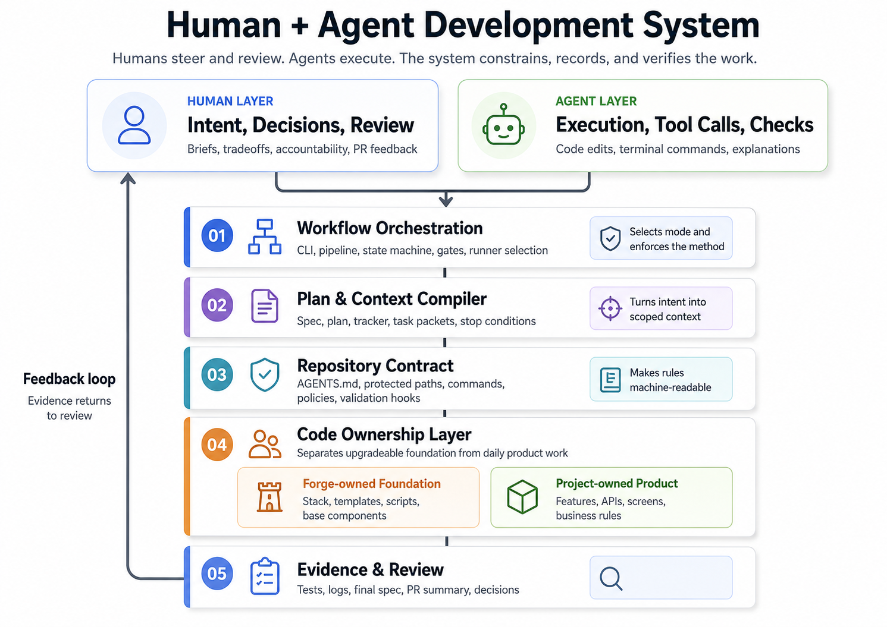
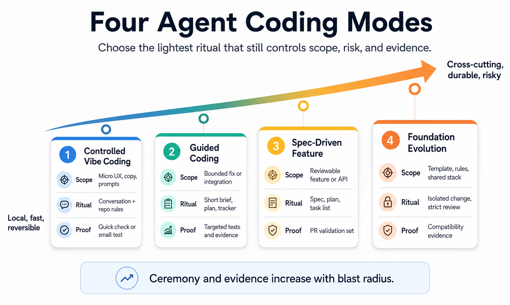

# Du vibe coding au développement agentique vérifiable { .article-title }

Le vibe coding a montré que l’intention en langage naturel pouvait devenir une interface de développement. Mais pour produire du logiciel maintenable, seul ou en équipe, il faut plus qu’une conversation avec un agent : il faut un repository agent-ready, un workflow qui applique les règles, un plan qui compile le contexte utile et des preuves qui rendent le travail reviewable.
{ .article-lead }

  Par Vincent El Kouby-Benichou, <a class="article-company-link" href="https://baracoda.com">Baracoda</a>
  <a class="article-contact-link" href="https://www.linkedin.com/in/vincentelkoubybenichou/">LinkedIn</a>

Le développement logiciel avec IA est souvent raconté comme une boucle individuelle : un développeur décrit ce qu’il veut, l’agent modifie la codebase, puis l’humain corrige ou valide. Cette boucle explique le succès du vibe coding : l’intention exprimée en langage naturel devient une interface directe avec le système logiciel.

Mais on ne développe pas seulement dans une conversation. On développe dans un repository, avec une architecture, des conventions, des dépendances, des scripts, des tests, des commits et une mémoire technique. En équipe, le repository est partagé, les pull requests doivent être relues, les règles de sécurité doivent être respectées et les décisions doivent survivre aux conversations individuelles.

Quand les agents de code entrent dans ce système, la vraie question n’est donc pas : « Quel prompt faut-il écrire ? » La vraie question est : **dans quel système l’agent doit-il travailler ?**

> L’enjeu de l’AI agent-based coding n’est pas d’allonger la conversation avec l’agent. Il est de mieux concevoir le système qui le guide, le limite et le vérifie.

Ce texte propose une méthode simple : rendre le repository agent-ready, appliquer les règles par un workflow, transformer le plan en contexte d’exécution et produire des preuves qui rendent le travail reviewable.

## Vibe coding et spec-driven : deux réponses utiles, mais incomplètes

Le vibe coding a révélé quelque chose d’important : une partie du logiciel se découvre par essai, observation, correction et conversation. C’est particulièrement vrai pour les prototypes, les détails d’interface, les ajustements UX, les explorations de workflow et les corrections rapides. Des travaux récents décrivent cette pratique comme une co-création conversationnelle avec l’IA, liée au flow et à l’expérimentation, mais aussi exposée à des fragilités : intention imprécise, fiabilité variable, debugging difficile et dérive du contexte. ([arXiv][1])

Il ne faut donc pas caricaturer le vibe coding. Sa valeur vient de sa vitesse : il réduit la friction entre « j’ai une idée » et « je vois quelque chose fonctionner ». Mais cette vitesse a un coût. Une revue de littérature décrit un paradoxe speed-quality : les utilisateurs sont attirés par la rapidité et l’accessibilité, tout en percevant souvent le code produit comme imparfait, avec des pratiques de QA négligées. ([arXiv][2])

Le spec-driven development répond à une partie de ce problème. GitHub a présenté Spec Kit comme un toolkit open source pour structurer les workflows d’agents de code autour de la spécification, du plan, du découpage en tâches et de l’implémentation. ([The GitHub Blog][3]) Sa documentation place la spécification au centre du développement assisté par IA : on décrit ce qu’il faut construire, on affine l’intention, puis l’agent implémente. ([GitHub Pages][4])

Cette approche stabilise l’intention : problème utilisateur, résultat attendu, règles métier, interactions et critères de succès. Mais elle ne doit pas devenir universelle. Une spec consomme du temps, du contexte, des tokens, de la review et de l’attention. Elle peut être disproportionnée pour une correction locale ou une itération rapide. Et puis une spec n'est jamais complète.

Le vibe coding donne la vitesse. Le spec-driven donne la stabilité. Aucun des deux, pris seul, ne donne un système de développement.

> Le vibe coding sans frontières produit de la dette. Le spec-driven appliqué partout produit de la bureaucratie.

La bonne réponse consiste donc à calibrer le niveau de structure selon le risque réel du changement, puis à faire porter cette structure par le repository, le workflow, le plan et les preuves.

## Le repository agent-ready : le template project comme contrat d’exécution

La première brique d’un développement AI-native industrialisable n’est pas le prompt. C’est le repository.

Un agent de code ne doit pas arriver dans un espace vague. Il doit arriver dans un environnement qui dit clairement où coder, comment coder, quoi réutiliser, quoi ne pas modifier, comment valider, comment prouver et quand s’arrêter.

Un repository agent-ready n’est pas seulement un repository bien documenté. C’est un repository dont les conventions humaines sont devenues actionnables par des agents : template exécutable, stack décidé par l’équipe, scripts standards, points d’extension, zones protégées, patterns réutilisables, commandes de validation et documentation opérationnelle.

Un template project n’est donc pas seulement un starter kit. C’est le contrat d’exécution de l’agent. Il définit les choix techniques que l’agent n’a plus à réinventer : structure du projet, architecture frontend et backend, conventions de nommage, librairies autorisées, design system, stratégie de test, règles de sécurité et points d’extension.

Sans ce contrat, l’agent optimise localement. Il ajoute une dépendance parce qu’elle semble pratique. Il recrée un composant déjà existant parce qu’il ne l’a pas retrouvé. Il corrige une demande métier en modifiant une primitive technique. Il produit du code fonctionnel, mais difficile à maintenir dans le système réel de l’équipe.

Les fichiers d’instructions pour agents sont utiles, mais ils ne suffisent pas. AGENTS.md propose un endroit prévisible pour placer les commandes de setup, les conventions, les règles de test ou les attentes de PR, et Codex documente aussi l’usage de ces fichiers. Mais ces fichiers ne doivent pas devenir des encyclopédies. Des travaux récents sur les context files montrent qu’ils peuvent augmenter le coût et parfois réduire le taux de réussite lorsqu’ils ajoutent trop d’exigences inutiles. La bonne direction n’est donc pas « plus d’instructions », mais « des instructions plus courtes, plus fiables et appliquées par le workflow ». ([AGENTS.md][11]) ([OpenAI Developers][12]) ([arXiv][13])

> Les docs agents décrivent les règles. Le workflow les applique. Le plan les transporte dans le contexte d’exécution.

Dans un monorepo, l’agent peut voir le frontend, le backend, le mobile, le SDK, la data, l’infra, les scripts et les librairies partagées. Cette visibilité est utile, mais elle augmente le risque de modifications hors périmètre. Un monorepo agent-ready doit donc permettre à l’agent de comprendre l’ensemble sans lui donner la même liberté partout.

## Séparer le socle technique du code produit

La séparation entre socle technique et code produit devient un principe central du développement AI-native.

Si un agent peut modifier indistinctement les primitives UI, les scripts, la configuration, les règles du repository, les composants de base et les features métier, chaque demande produit peut devenir une dette de plateforme.

Il faut donc distinguer deux zones.

La première est la couche de fondation. Elle contient la structure du projet, les conventions, les composants de base, la configuration, les scripts, les workflows CLI, les règles agents, les mécanismes de validation, les capabilities réutilisables et la documentation technique. Cette couche change moins souvent, avec plus de contrôle.

La seconde est la couche produit. Elle contient les features métier, les écrans spécifiques, les domaines applicatifs, les API produit, les modèles métier, les prompts métier, les règles business, la documentation produit et les spécifications de feature. C’est la zone principale d’intervention quotidienne des agents.

La règle doit être simple :

> Si un changement peut être fait dans la couche produit, il ne doit pas être fait dans la couche fondation.

Cette séparation protège l’architecture et rend le socle upgradeable. Un template ou une fondation technique ne peut évoluer proprement que si l’équipe sait encore quels fichiers appartiennent au framework et quels fichiers appartiennent au produit.

C’est le type de frontière qu’un système de développement AI-native doit matérialiser : un socle full-stack propre, testable, documenté et upgradeable, avec une séparation stricte entre chemins foundation-owned et project-owned, un contrat machine, des validations, des preuves et un workflow durable indépendant de la mémoire du chat.

<figure class="article-diagram">
  
  <figcaption>Human + agent development system: humans steer, agents execute, and the workflow turns repository rules into verifiable execution.</figcaption>
</figure>

## Quatre modes d’intervention pour calibrer le niveau de rituel

L’erreur inverse serait de répondre au chaos du vibe coding par une bureaucratie généralisée. Si chaque micro-changement devient une spec complète, une équipe tuera la vitesse qui rend les agents utiles.

Une méthode AI-native doit calibrer le niveau de structure selon l’impact réel du changement. Je distingue quatre modes de développement.

**Foundation evolution** concerne les changements de socle : template, capability commune, design system, architecture backend, règles agents, workflow CLI ou scripts de validation. Ce mode est risqué parce qu’il modifie les règles dans lesquelles les agents coderont demain. La fondation est souvent commune à plusieurs projets ; elle doit donc être isolée, versionnée et revue avec plus d’attention.

> Modifier le socle, c’est modifier les règles selon lesquelles les agents coderont les prochaines features.

**Spec-driven feature** concerne les features significatives : workflow métier, nouvelle API, page complète, intégration entre plusieurs composants, traitement IA dans un pipeline, capacité mobile, data ou infra. Ici, la spécification stabilise l’intention avant l’exécution. Quand la feature est complexe, il vaut mieux itérer sur la spécification que sur le code.

**Guided coding** couvre les besoins bornés mais non triviaux : connecter une donnée backend, ajouter une option, corriger un bug reproductible, ajuster un flux IA existant. On ne lance pas toute une mécanique de spec, mais on produit un plan court, un tracker, un contexte propre et une validation ciblée.

> Le guided coding est le mode du brief court, du plan court et de l’exécution contrôlée.

**Vibe coding contrôlé** reste adapté aux micro-ajustements : libellé, bouton, état vide, variante visuelle, couleur avec tokens existants, prompt métier. La conversation garde sa valeur, mais le périmètre doit rester local, réversible et soumis aux règles du repository.

> Le vibe coding garde sa valeur quand il reste local, réversible et soumis aux règles du repository.

<figure class="article-diagram">
  
  <figcaption>Four agent coding modes calibrated by scope, risk, ceremony, and evidence.</figcaption>
</figure>

Ces modes forment une échelle. Plus le changement est transversal, durable ou risqué, plus il doit remonter vers des modes structurés. Plus il est local, observable et réversible, plus il peut descendre vers des modes légers. La bonne unité de travail reste la **feature reviewable** : une branche, une PR, une intention lisible, un périmètre borné, des validations et des preuves. Si le besoin ne tient pas dans une branche et une PR lisible, ce n’est pas le workflow qu’il faut complexifier. C’est le besoin qu’il faut découper.

> Une méthode AI-native n’impose pas le même rituel à toutes les tâches. Elle impose le bon niveau de rituel à chaque type de changement.

## Le plan comme compilateur de contexte

Le repository impose la structure et les règles du projet. La spécification stabilise l’intention lorsque le changement le justifie. Reste une question plus opérationnelle : comment faire respecter tout cela aux agents au moment de l’exécution ?

Le grand sujet du développement AI-native n’est pas le prompt engineering. C’est le context engineering : sélectionner, compresser et organiser ce que l’agent voit, au lieu d’empiler toujours plus d’informations dans la fenêtre de contexte. Cette évolution est aussi décrite par Martin Fowler et Thoughtworks comme un sujet central des coding agents. ([Martin Fowler][15])

Un agent ne doit pas relire tout le repository pour chaque tâche. Il ne doit pas recevoir un dump massif de documentation, de fichiers, de conventions et de fragments de conversation. Il doit recevoir le bon contexte au bon moment.

C’est ici que le plan de développement change de nature. Il ne doit pas être une simple checklist. Il doit devenir un compilateur de contexte : d’un côté le contexte de workflow — mode choisi, étapes obligatoires, tracker, validations, preuves, conditions d’arrêt, règles de reprise — et de l’autre le contexte de repository — architecture concernée, chemins autorisés, chemins protégés, patterns à réutiliser, composants existants, conventions de test et commandes de validation.

Cette logique rejoint une tendance plus large des outils d’agents de code. Dans son analyse de la boucle agentique de Codex, OpenAI décrit le rôle du harness comme l’orchestration entre l’utilisateur, le modèle et les outils mobilisés pour produire un travail logiciel réel. ([OpenAI][6]) Les Codex Skills vont dans le même sens avec une logique de progressive disclosure. ([OpenAI Developers][7])

> Le bon contexte agentique n’est pas un résumé du repository. C’est un ordre de mission dérivé du plan.

Un task packet devrait contenir seulement ce dont l’agent a besoin pour exécuter une tâche : objectif, périmètre, chemins autorisés, chemins interdits, fichiers probablement concernés, patterns à réutiliser, commandes de validation, critères de fin, conditions d’arrêt et preuves attendues.

Les travaux sur Spec Kit Agents pointent le même problème sous un autre angle : dans de grands repositories, les agents deviennent facilement context blind, hallucinent des API ou violent des contraintes d’architecture. Leur réponse consiste à ajouter des hooks de grounding et de validation à chaque phase du workflow. ([arXiv][17])

> Le plan transforme les règles générales du projet en contexte spécifique pour une exécution agentique.

## Workflow et preuves : rendre l’exécution agentique reviewable

On ne doit pas demander à un agent de se souvenir de toute la méthode pendant plusieurs heures. Le workflow doit appartenir au système de développement : une CLI, un orchestrateur local, un pipeline ou des scripts.

L’agent exécute. Le système orchestre et vérifie.

Cette distinction est décisive. Un agent peut proposer un plan, modifier le code, lancer des commandes, expliquer ses décisions et produire une synthèse. Mais il ne doit pas être le seul juge de sa propre exécution. Il peut oublier une étape, déclarer trop tôt que tout est terminé, ne pas lancer les tests, modifier une zone interdite ou produire un résumé plus optimiste que la réalité.

Un workflow CLI doit donc créer l’unité de travail, sélectionner le mode de développement, enregistrer le brief, produire le plan, créer le tracker, compiler les task packets, appeler le runner agentique, contrôler les fichiers modifiés, vérifier les chemins interdits, lancer ou demander les validations, enregistrer les preuves et préparer la synthèse de PR. Codex CLI illustre le rôle possible d’un runner local, mais le runner ne doit pas porter toute la méthode : les agents peuvent changer ; le repository et le workflow doivent rester. ([OpenAI Developers][8])

C’est aussi le sens du harness engineering : traiter le repository comme un système de connaissance structuré, donner à l’agent une carte plutôt qu’un manuel de mille pages, et placer les règles dans un environnement que le workflow peut exploiter. ([OpenAI][14])

> Le modèle peut changer. Le repository et le workflow restent. La méthode doit donc appartenir au système de développement, pas au modèle.

Dans ce cadre, la preuve devient un artefact de développement. Elle ne se réduit pas aux logs de tests ou aux sorties de commandes. Elle relie l’intention initiale, le plan d’exécution, les tâches réalisées, les validations obtenues et le comportement effectivement livré.

Une feature peut commencer par une spécification complète, un plan court de guided coding ou un patch conversationnel contrôlé. Mais au moment du merge, elle doit se fermer avec une trace claire : ce qui était demandé, ce qui a été planifié, ce qui a été fait, ce qui a changé en cours de route, ce qui a été validé et ce qui est finalement livré.

Dans un processus spec-driven, la spécification initiale exprime l’intention de départ. La spécification finale doit décrire le produit réellement livré : non pas la spec idéale du début, mais la description fidèle du système mergé.

Cette logique ne remplace pas Git. Elle le renforce. GitHub décrit les pull requests comme un mécanisme central de collaboration permettant de proposer, discuter et relire des changements avant merge. ([GitHub Docs][9]) Dans un workflow AI-native, la branche devient l’espace d’exécution, et la PR devient le point de convergence entre code, plan, preuves, décisions, validations et spécification finale.

Le plan porte le contexte. Le tracker porte l’état. Le prompt déclenche l’exécution. Une tâche agentique devrait être située dans un plan, une phase, une branche, un fichier de tracking, un périmètre et des validations attendues. C’est cette trace qui rend le travail auditable, reprenable et reviewable.

Le développement AI-native ne doit pas seulement produire du code. Il doit produire la mémoire vérifiable de sa propre exécution. Cette idée rejoint des travaux récents qui formalisent le passage du vibe coding à une ingénierie vérifiée comme un problème de process control : spécifier, contraindre, orchestrer, prouver et vérifier, plutôt que seulement améliorer les prompts. ([arXiv][16])

## La granularité comme paramètre économique

Une fois que le repository, le workflow, le plan et les preuves sont en place, la vraie variable d’optimisation devient la taille du lot de travail.

Dans les approches spec-driven, la taille des tâches n’est pas seulement une question méthodologique. C’est une question économique.

Une tâche trop petite coûte cher en contexte, orchestration, validation et reprise. Une tâche trop grande augmente le risque de dérive, de diff illisible, de dette cachée et de review impossible.

Le bon batch doit être assez large pour amortir le coût de contexte, assez cohérent pour rester dans une seule intention, assez borné pour tenir dans une PR et assez vérifiable pour produire des preuves solides.

Trop gros : « refaire toute l’application, ajouter les permissions, changer le design system et migrer la base ».

Trop petit : « créer le fichier vide du composant bouton de filtre ».

Bonne granularité : « implémenter la liste clients avec chargement API, états vide/erreur/loading, pagination et tests de rendu, en utilisant les composants existants ».

La granularité devient le paramètre économique central parce qu’elle détermine le coût en tokens, le coût en temps, le coût de validation, le coût de review humaine, le risque de divergence, la fatigue cognitive, le coût de reprise et le coût d’intégration.

> La granularité est le paramètre économique central du développement avec agents.

On parle beaucoup de la qualité du modèle, de la taille de la fenêtre de contexte, du prompt ou du choix entre agents et IDE. Mais une équipe peut perdre une grande partie de la valeur des agents simplement parce qu’elle découpe mal le travail. Le bon découpage correspond à une unité que l’agent peut exécuter, que le système peut valider et qu’un humain peut relire.

## Industrialiser sans bureaucratiser

Aller vers un développement AI-native industriel, ce n’est pas annoncer que les agents écriront demain tout le logiciel. C’est définir une méthode simple pour travailler avec eux sans perdre la maîtrise du code.

Cette méthode tient en quatre briques : le repository porte les règles, le workflow les applique, le plan transforme l’intention en contexte d’exécution, les preuves rendent le travail reviewable.

Ce cadre ne s’oppose pas au vibe coding. Il le remet à sa juste place. On doit pouvoir prototyper vite, corriger localement, ajuster une interface ou explorer une idée sans produire une spec complète. Mais dès qu’un changement devient durable, transversal ou difficile à relire, il doit remonter vers un mode plus structuré : guided coding, spec-driven feature ou foundation evolution.

Ce n’est pas contradictoire avec l’esprit agile : préserver la vitesse et s’adapter au changement, sans confondre légèreté et absence de méthode. ([Manifesto for Agile Software Development][10])

À ce niveau, le prompt reste utile, mais il n’est plus le centre du système. Le prompt exprime l’intention du moment. Le repository porte les règles. Le plan compile le contexte utile. Le workflow orchestre, contrôle et trace. Les preuves permettent de relire, reprendre et maintenir.

C’est cela, industrialiser l’AI agent-based coding : ne plus traiter l’agent comme un partenaire de conversation isolé, mais comme un contributeur puissant inséré dans une méthode de travail simple, vérifiable et partageable.

Pour rendre cette méthode concrète, il faut commencer par le terrain sur lequel l'agent intervient : [**ce que le repository doit lui apprendre et lui interdire avant qu'il ne code**](../agent-ready-repository/index.md).

  
Pour discuter de cet article ou me laisser un message public :

  <a class="article-contact-link" href="https://github.com/velkouby/ai-based-development/issues/new?template=contact.yml">Message sur GitHub</a>

## Références

1. [Good Vibrations? A Qualitative Study of Co-Creation, Communication, Flow, and Trust in Vibe Coding][1]
2. [Vibe Coding in Practice: Motivations, Challenges, and a Future Outlook — a Grey Literature Review][2]
3. [Spec-driven development with AI: Get started with a new open source toolkit][3]
4. [Spec Kit Documentation][4]
5. [github/spec-kit][5]
6. [Unrolling the Codex agent loop][6]
7. [Agent Skills — Codex][7]
8. [Codex CLI][8]
9. [About pull requests][9]
10. [Manifesto for Agile Software Development][10]
11. [AGENTS.md][11]
12. [Custom instructions with AGENTS.md — Codex][12]
13. [Evaluating AGENTS.md: Are Repository-Level Context Files Helpful for Coding Agents?][13]
14. [Harness engineering: leveraging Codex in an agent-first world][14]
15. [Context Engineering for Coding Agents][15]
16. [Agentic Agile-V: From Vibe Coding to Verified Engineering in Software and Hardware Development][16]
17. [Spec Kit Agents: Context-Grounded Agentic Workflows][17]

[1]: https://arxiv.org/abs/2509.12491 "Good Vibrations? A Qualitative Study of Co-Creation, Communication, Flow, and Trust in Vibe Coding"
[2]: https://arxiv.org/abs/2510.00328 "Vibe Coding in Practice: Motivations, Challenges, and a Future Outlook — a Grey Literature Review"
[3]: https://github.blog/ai-and-ml/generative-ai/spec-driven-development-with-ai-get-started-with-a-new-open-source-toolkit/ "Spec-driven development with AI: Get started with a new open source toolkit"
[4]: https://github.github.com/spec-kit/ "Spec Kit Documentation"
[5]: https://github.com/github/spec-kit "github/spec-kit"
[6]: https://openai.com/index/unrolling-the-codex-agent-loop/ "Unrolling the Codex agent loop"
[7]: https://developers.openai.com/codex/skills "Agent Skills — Codex"
[8]: https://developers.openai.com/codex/cli "Codex CLI"
[9]: https://docs.github.com/pull-requests/collaborating-with-pull-requests/proposing-changes-to-your-work-with-pull-requests/about-pull-requests "About pull requests"
[10]: https://agilemanifesto.org/ "Manifesto for Agile Software Development"
[11]: https://agents.md/ "AGENTS.md"
[12]: https://developers.openai.com/codex/guides/agents-md "Custom instructions with AGENTS.md — Codex"
[13]: https://arxiv.org/abs/2602.11988 "Evaluating AGENTS.md: Are Repository-Level Context Files Helpful for Coding Agents?"
[14]: https://openai.com/index/harness-engineering/ "Harness engineering: leveraging Codex in an agent-first world"
[15]: https://martinfowler.com/articles/exploring-gen-ai/context-engineering-coding-agents.html "Context Engineering for Coding Agents"
[16]: https://arxiv.org/abs/2605.20456 "Agentic Agile-V: From Vibe Coding to Verified Engineering in Software and Hardware Development"
[17]: https://arxiv.org/abs/2604.05278 "Spec Kit Agents: Context-Grounded Agentic Workflows"
