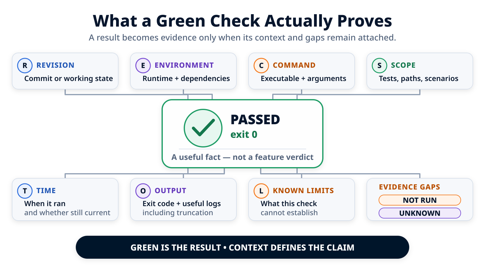

# « Les tests passent » : que prouve le workflow ? { .article-title }

Trois commandes retournent `0` sur la deuxième tentative. Cinq fichiers sont modifiés, tous dans le périmètre. Pourtant, la conclusion exacte n'est pas « feature validée » : un état local identifié a franchi des contrôles précis, après une première tentative rouge que le workflow a conservée.
{ .article-lead }

<p class="article-meta">
  <span>Par <span class="article-author">Vincent El Kouby-Benichou</span>, <a class="article-company-link" href="https://baracoda.com">Baracoda</a></span>
  <a class="article-contact-link" href="https://www.linkedin.com/in/vincentelkoubybenichou/">LinkedIn</a>
</p>

Dans [l'article précédent](../agent-task-stop-and-resume/index.md), nous avons suivi l'échec frontend de la tentative 001 jusqu'à la correction bornée de la tentative 002. Nous avons aussi vu pourquoi une synchronisation URL sous `shared/routing/**` imposerait un autre arrêt. Restons maintenant sur le parcours de réparation locale réussi, dont le paquet n'écrit que dans `backend/customers/**` et `frontend/customers/**`.

Le runner vient d'achever une deuxième tentative. Avant de résumer son résultat par « les tests passent », ouvrons l'état Git, les commandes et le manifeste que la personne chargée de la revue recevra réellement.

Le point à démontrer est simple : un résultat vert devient utile lorsqu'on peut répondre à cinq questions.

1. Sur quel état du code la commande a-t-elle tourné ?
2. Qu'a-t-elle réellement exécuté ?
3. Quel résultat observable a-t-elle produit ?
4. Quelle partie du changement ce résultat couvre-t-il ?
5. Qu'est-ce qui reste non exécuté, inconnu ou soumis à une décision humaine ?

> Le vert résume le résultat d'une commande. La preuve conserve l'état, la portée, l'historique et les lacunes nécessaires pour l'interpréter.

## Partir d'un état identifiable

Avant la première tentative, le workflow relève la branche, la révision de départ et l'état de la copie de travail :

```console
$ git branch --show-current
feature/customer-pagination

$ git rev-parse --short HEAD
7a31c42

$ git status --short --untracked-files=all
```

La dernière commande ne produit aucune ligne. Dans cette observation, la copie de travail, l'index Git et la liste des fichiers non suivis sont vides. Le paquet commence donc sur la branche `feature/customer-pagination`, depuis le commit `7a31c42`, sans modification locale détectée.

Cette capture ne garantit pas que le repository restera propre. Elle fixe seulement le point de comparaison avant que le runner exécute T-01, T-02 et T-03 : faire évoluer le contrat backend, adapter l'annuaire frontend, puis relire leur cohérence.

Le runner charge le paquet, modifie les cinq fichiers attendus et déclare les trois tâches terminées. Cette déclaration déclenche les contrôles ; elle ne les remplace pas.

## Tentative 001 : deux commandes vertes, un comportement rouge

Le contrôle de chemins passe : les fichiers observés appartiennent tous aux zones produit autorisées. Le workflow lance alors les trois validations ciblées inscrites dans l'ordre de mission.

```text
Tentative 001

Contrôle de chemins
  statut : passed

$ make test-back
  code de retour : 0

$ make test-front
  FAIL CustomerList > disables Next on the last page
  attendu : disabled
  reçu    : enabled
  code de retour : 1

$ make build-front
  code de retour : 0

Qualité globale
  statut : not_run

Statut de la tentative
  needs_retry
```

Cette combinaison est riche d'enseignements. Le backend passe. Le frontend compile. Pourtant, un comportement observable reste faux : sur la dernière page, le bouton « Suivant » est encore actif.

Le build vert n'annule pas le test rouge. Ces commandes ne posent pas la même question. `make build-front` établit que le frontend demandé peut être construit dans cet environnement ; il ne vérifie pas que la navigation respecte les bornes de pagination.

La tentative passe donc à `needs_retry`. Le workflow conserve le nom du test, le résultat attendu, le résultat reçu et les deux autres commandes vertes. Il ne remplace pas l'ensemble par un vague « les tests échouent » et ne marque pas non plus la feature comme terminée parce que deux contrôles sur trois ont réussi.

## Tentative 002 : corriger un fichier, puis revalider l'ensemble

Le diagnostic ne demande ni nouvelle décision produit, ni dépendance, ni extension du périmètre. La correction peut rester dans le composant qui porte le comportement :

```text
fichier changé pendant la tentative 002
  frontend/customers/customer-list.tsx
```

La tentative 002 reçoit l'échec précédent, la même autorité d'écriture et les mêmes validations. Après la correction, le workflow contrôle de nouveau les chemins puis relance les trois commandes prévues pour le paquet :

```text
Tentative 002

Contrôle de chemins
  statut : passed

$ make test-back
  code de retour : 0

$ make test-front
  code de retour : 0

$ make build-front
  code de retour : 0

Qualité globale
  statut : not_run

Statut de la tentative
  completed
```

Relancer les trois commandes produit ici une preuve cohérente sur l'état final du paquet. Une autre politique pourrait sélectionner un sous-ensemble justifié par l'impact de la correction ; dans ce parcours, le contrat demande les trois validations et elles sont donc toutes rejouées.

Le dernier vert ne réécrit pas l'histoire. La tentative 001 reste visible avec son échec, et la tentative 002 montre la correction bornée qui a permis d'obtenir le nouveau résultat.

<figure class="article-diagram">
  
  <figcaption>Le résultat vert de la tentative 002 n'est interprétable qu'avec son état Git, son périmètre, la tentative rouge précédente et les contrôles absents.</figcaption>
</figure>

## Ce que Git observe réellement

À la fin de la tentative 001, le workflow a conservé les mêmes observations Git que celles qu'il va maintenant relever à nouveau. À la fin de la tentative 002, la copie de travail contient encore le diff complet de la fonctionnalité. Le runner n'a changé qu'un fichier pendant cette seconde tentative, mais les quatre autres modifications produites pendant la première sont toujours présentes.

```console
$ git branch --show-current
feature/customer-pagination

$ git rev-parse --short HEAD
7a31c42

$ git diff --name-only
backend/customers/api.py
backend/customers/tests/test_pagination.py
frontend/customers/customer-api.ts
frontend/customers/customer-list.tsx
frontend/customers/customer-list.test.tsx

$ git diff --cached --name-only

$ git ls-files --others --exclude-standard
```

Les deux premières commandes confirment que le runner est resté sur la branche de départ et que `HEAD` vaut toujours `7a31c42`. `git diff --name-only` compare la copie de travail à l'index ; comme l'index ne contient aucun changement et pointe toujours vers ce même `HEAD`, les cinq chemins composent aussi le diff depuis le commit de départ. La dernière commande ne trouve aucun fichier non suivi.

Le rapprochement entre les captures permet deux affirmations distinctes :

- entre le départ propre et l'état final, cinq fichiers sont apparus dans le diff de la fonctionnalité ;
- entre le début et la fin de la tentative 002, seul `frontend/customers/customer-list.tsx` a changé.

Cette distinction évite d'attribuer toute la feature à la tentative de réparation. Elle évite aussi de confondre la liste déclarée par l'agent avec la liste observée par Git. Sans checkpoints intermédiaires entre T-01, T-02 et T-03, Git ne permet toujours pas de prouver quelle tâche a produit chaque ligne.

## Contrôler les chemins fichier par fichier

L'ordre de mission autorise l'écriture dans `backend/customers/**` et `frontend/customers/**`. Les couches partagées restent en lecture seule ; le tooling, les fichiers générés et l'état du workflow sont interdits.

| Chemin observé | Règle correspondante | Conclusion |
| --- | --- | --- |
| `backend/customers/api.py` | `backend/customers/**` | Écriture autorisée |
| `backend/customers/tests/test_pagination.py` | `backend/customers/**` | Écriture autorisée |
| `frontend/customers/customer-api.ts` | `frontend/customers/**` | Écriture autorisée |
| `frontend/customers/customer-list.tsx` | `frontend/customers/**` | Écriture autorisée |
| `frontend/customers/customer-list.test.tsx` | `frontend/customers/**` | Écriture autorisée |

Aucun chemin observé ne touche `shared/ui/**`, `shared/state/**`, `shared/routing/**`, `tooling/**`, `generated/**` ou `workflow-state/**`. Le statut `passed` signifie donc : **tous les chemins inclus dans cette observation correspondent à une zone modifiable du paquet**.

Il ne signifie pas que le processus était techniquement incapable d'écrire ailleurs. Le contrôle intervient après l'écriture ; ce n'est pas un sandbox. Il ne détecte pas non plus une erreur métier située dans un chemin autorisé — précisément ce que le test frontend de la tentative 001 a révélé.

## Ouvrir le manifeste de la tentative 002

Le manifeste rassemble les faits nécessaires pour reconstruire le dernier résultat sans effacer la tentative précédente :

```yaml
evidence:
  attempt:
    id: "002"
    previous_attempt: "001"
    status: completed
    source: local

  revision:
    branch: feature/customer-pagination
    base_commit: 7a31c42
    current_head: 7a31c42
    result_commit: null
    feature_started_clean: true
    mutable_working_tree: true

  git:
    carried_from_attempt_001:
      - backend/customers/api.py
      - backend/customers/tests/test_pagination.py
      - frontend/customers/customer-api.ts
      - frontend/customers/customer-list.tsx
      - frontend/customers/customer-list.test.tsx
    changed_during_attempt_002:
      - frontend/customers/customer-list.tsx
    final_modified_files:
      - backend/customers/api.py
      - backend/customers/tests/test_pagination.py
      - frontend/customers/customer-api.ts
      - frontend/customers/customer-list.tsx
      - frontend/customers/customer-list.test.tsx
    staged_files: []
    untracked_files: []

  path_policy:
    status: passed
    violations: []

  validations:
    - command: make test-back
      exit_code: 0
      status: passed
      criteria: [AC-1]
    - command: make test-front
      exit_code: 0
      status: passed
      criteria: [AC-2, AC-3, AC-4]
    - command: make build-front
      exit_code: 0
      status: passed
      criteria: []

  global_quality:
    status: not_run

  previous_attempt:
    id: "001"
    status: needs_retry
    failed_command: make test-front
    failure: "Next remained enabled on the last page"

  agent_declaration:
    status: completed
    open_questions: []

  human_review:
    status: pending
```

Plusieurs séparations sont volontaires. `agent_declaration` rapporte ce que le runner dit avoir terminé ; `git`, `path_policy` et `validations` contiennent des observations du workflow. `previous_attempt` conserve le rouge qui explique la reprise. `human_review` reste `pending`, même lorsque toutes les validations ciblées sont vertes.

Deux valeurs empêchent surtout une conclusion trop large. `global_quality: not_run` indique que le profil de qualité global n'a pas été lancé. `result_commit: null` indique que ce manifeste décrit encore une copie de travail mutable, pas un commit contenant exactement le changement revu. `current_head: 7a31c42` consigne le vrai `HEAD` Git : c'est la base sous le diff non commité, pas une identité de ce diff.

## Relier chaque critère à un contrôle

Une commande ne couvre pas une feature « en général ». Le plan doit indiquer la question qu'elle est censée exercer, puis la revue doit vérifier que les tests présents correspondent réellement à cette intention.

| Critère d'acceptation | Contrôle prévu | Résultat observé en tentative 002 | Ce qui reste à relire |
| --- | --- | --- | --- |
| **AC-1.** L'API renvoie les éléments, la page courante et le total ; une page invalide répond HTTP 404 avec le code `pagination_page_invalide` | `make test-back` | Code de retour `0` | Les cas présents dans la suite et la compatibilité des consommateurs connus |
| **AC-2.** L'utilisateur avance et revient sans dépasser la première ou la dernière page | `make test-front` | Code de retour `0` ; la borne haute avait échoué en tentative 001 | La fidélité du scénario de test à l'interaction attendue |
| **AC-3.** Les états `loading`, `empty` et `error` restent distincts | `make test-front` | Code de retour `0` | Le rendu visuel, le clavier et l'accessibilité |
| **AC-4.** L'annuaire charge la première page à l'ouverture | `make test-front` | Code de retour `0` | La cohérence de la valeur par défaut avec le brief |
| Le frontend doit rester constructible | `make build-front` | Code de retour `0` | Ce contrôle structurel ne juge pas le comportement produit |

La colonne « contrôle prévu » vient du plan. La colonne « résultat observé » vient de l'exécution. Les confondre ferait croire que le simple nom d'une commande garantit sa couverture. Pour renforcer le lien, le manifeste peut conserver les identifiants de tests pertinents ou des sorties consultables ; la revue reste chargée de vérifier que cette association est crédible.

## Ce que l'on peut affirmer — et rien de plus

| Élément de preuve | Affirmation légitime | Affirmation non soutenue |
| --- | --- | --- |
| Départ propre et inspection Git finale | Ces cinq chemins composent le diff local observé depuis `7a31c42` | Chaque ligne est attribuable indépendamment à une tâche précise |
| Politique de chemins `passed` | Tous les chemins observés correspondent à une règle d'écriture | Le processus ne pouvait pas écrire ailleurs |
| `make test-back` retourne `0` | Cette commande backend a réussi sur l'état local final | L'API est correcte dans tous les environnements |
| `make test-front` retourne `0` en tentative 002 | Les scénarios frontend présents ont réussi après la correction | Tous les navigateurs, états visuels et usages accessibles sont corrects |
| `make build-front` retourne `0` | Le build demandé s'est terminé avec succès | La fonctionnalité est utilisable ou acceptable |
| `global_quality: not_run` | Aucun résultat de qualité globale n'existe pour cette tentative | La qualité globale a implicitement réussi |
| `result_commit: null` | Aucun commit ne contient encore exactement le diff validé localement | Les mêmes résultats s'appliquent déjà à une révision de pull request |

Les lacunes doivent rester des données. **Non exécuté** signifie qu'un contrôle identifié n'a pas tourné. **Inconnu** signifie qu'une information nécessaire — par exemple une version d'outil non capturée — manque. **Tronqué** doit apparaître si seule une partie d'une sortie est conservée. **Instable** doit rester visible lorsqu'un contrôle passe après un échec sans cause comprise.

Notre test frontend n'est pas classé instable : une cause précise a été observée, un fichier a été corrigé et une nouvelle tentative a été enregistrée. Cela ne prouve pas que le diagnostic était exhaustif ; cela rend au moins le raisonnement vérifiable et réfutable.

## Le rapport de revue final

Le manifeste est adapté aux outils. La personne qui relit a besoin d'une synthèse plus directe, sans perte de provenance :

```markdown
# Revue locale — pagination de l'annuaire clients

Point de départ :
- branche : feature/customer-pagination
- commit de base : 7a31c42
- copie de travail propre avant la tentative 001

Exécution :
- tentative 001 : needs_retry
- tentative 002 : completed
- correction bornée : frontend/customers/customer-list.tsx

Changement observé :
- 5 fichiers modifiés
- 0 fichier indexé
- 0 fichier non suivi
- politique de chemins : passed

Validations ciblées sur la tentative 002 :
- make test-back : passed
- make test-front : passed
- make build-front : passed

Non exécuté :
- profil de qualité global
- CI
- revue humaine visuelle et d'accessibilité

Décision :
- prêt pour la revue locale du diff
- pas encore rattaché à un commit de résultat
- pas encore approuvé pour le merge
```

Cette synthèse ne dit pas « la pagination est validée ». Elle dit pourquoi le diff peut maintenant être relu, quelles validations ciblées ont réussi, quel échec a précédé ce résultat et quelles portes restent fermées.

## De la copie de travail au commit et à la CI

La preuve locale s'arrête sur `current_head: 7a31c42` et `result_commit: null`. Tant que le changement reste dans une copie de travail, un fichier peut encore être modifié après les commandes vertes. Le résultat de la tentative 002 ne s'applique pas automatiquement à ce nouvel état.

Le passage de relais attendu est donc explicite :

```text
tentative 002 sur une copie de travail mutable
  -> revue humaine du diff local
  -> création d'un commit contenant exactement ce diff
  -> validations CI sur ce commit de tête
  -> pull request réunissant diff, résultats, lacunes et décisions
  -> acceptation, demande de reprise ou refus par un humain
```

Git fournit alors une identité de contenu. La CI exécute des contrôles sur cette identité dans un environnement décrit par le pipeline. Aucun des deux ne décide que les commandes sont suffisantes, que les critères sont correctement couverts ou que le risque résiduel est acceptable.

Si un correctif est ajouté après le commit validé, le lien doit être recalculé : nouveau commit de tête, nouveaux résultats. Une interface fiable rend un vert devenu obsolète visible au lieu de le laisser attaché à la pull request comme s'il concernait encore son dernier état.

## Conclusion

Dans cet exemple, « les tests passent » peut être remplacé par une phrase vérifiable : sur la tentative 002, depuis le commit de base `7a31c42`, les cinq fichiers observés restent dans le périmètre autorisé et les commandes `make test-back`, `make test-front` et `make build-front` retournent `0`. La qualité globale n'a pas été exécutée, aucun commit de résultat ne contient encore le diff et la revue humaine reste en attente.

Cette formulation est moins triomphale. Elle est aussi beaucoup plus exploitable.

Elle referme le parcours ouvert au début de cette série : [la vue d'ensemble pose le workflow complet](../ai-agent-based-coding-best-practices/index.md), [le repository rend les règles visibles](../agent-ready-repository/index.md), [le mode détermine le niveau de contrôle](../agent-coding-modes/index.md), [la feature suit un parcours de bout en bout](../agentic-feature-end-to-end/index.md), le plan devient [un ordre de mission](../agent-execution-package/index.md), le runner propose une modification, [les arrêts restent traçables](../agent-task-stop-and-resume/index.md), et la preuve locale prépare enfin Git, la CI et la décision humaine sans se substituer à eux.

Un workflow agentique fiable ne promet pas que l'agent aura toujours raison. Il rend possible une question plus utile : **sur quels faits précis acceptons-nous ce changement, et quels risques décidons-nous encore d'assumer ?**

<div class="article-footer-contact">
  <p>Pour discuter de cet article ou me laisser un message public :</p>
  <a class="article-contact-link" href="https://github.com/velkouby/ai-based-development/issues/new?template=contact.yml">Message sur GitHub</a>
</div>
